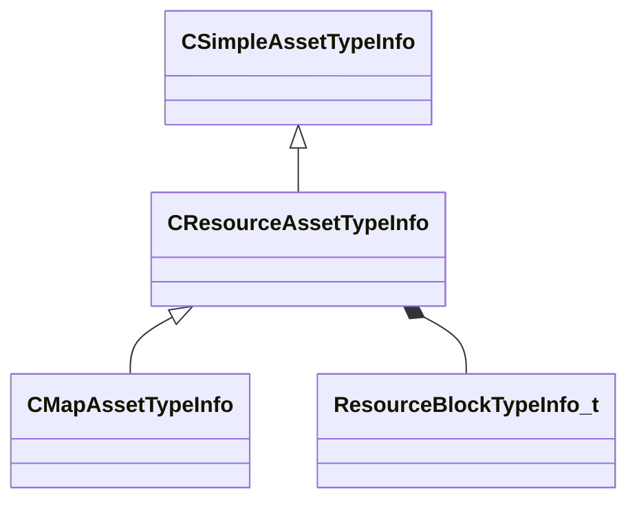

[Schemas](../../schemas.md) / [toolutils2](../toolutils2.md) / CResourceAssetTypeInfo

# CResourceAssetTypeInfo

**Kind:** class · **Size:** 328 bytes (`0x148`) · **Align:** 8 · **Module:** toolutils2

**Inherits from:** [CSimpleAssetTypeInfo](../toolutils2/CSimpleAssetTypeInfo.md)

**Derived by:** [CMapAssetTypeInfo](../toolutils2/CMapAssetTypeInfo.md)

**Relationships:**

## Memory layout

32 fields (8 declared here, 24 inherited). Offsets are absolute from the object base.

| Offset | Field | Type | From | Annotations |
|--------|-------|------|------|-------------|
| `0x10` | `m_FriendlyName` | CUtlString | [CSimpleAssetTypeInfo](../toolutils2/CSimpleAssetTypeInfo.md) |  |
| `0x18` | `m_Ext` | CUtlString | [CSimpleAssetTypeInfo](../toolutils2/CSimpleAssetTypeInfo.md) |  |
| `0x20` | `m_IconLg` | CUtlString | [CSimpleAssetTypeInfo](../toolutils2/CSimpleAssetTypeInfo.md) |  |
| `0x28` | `m_IconSm` | CUtlString | [CSimpleAssetTypeInfo](../toolutils2/CSimpleAssetTypeInfo.md) |  |
| `0x30` | `m_SuppressSubstrings` | CUtlVector< CUtlString > | [CSimpleAssetTypeInfo](../toolutils2/CSimpleAssetTypeInfo.md) |  |
| `0x48` | `m_AdditionalExtensions` | CUtlVector< CUtlString > | [CSimpleAssetTypeInfo](../toolutils2/CSimpleAssetTypeInfo.md) |  |
| `0x60` | `m_EngineCommands` | CUtlVector< [AssetEngineCommand_t](../toolutils2/AssetEngineCommand_t.md) > | [CSimpleAssetTypeInfo](../toolutils2/CSimpleAssetTypeInfo.md) |  |
| `0x78` | `m_LimitToMods` | CUtlVector< CUtlString > | [CSimpleAssetTypeInfo](../toolutils2/CSimpleAssetTypeInfo.md) |  |
| `0x90` | `m_ExcludeFromMods` | CUtlVector< CUtlString > | [CSimpleAssetTypeInfo](../toolutils2/CSimpleAssetTypeInfo.md) |  |
| `0xa8` | `m_HideForRetailMods` | CUtlVector< CUtlString > | [CSimpleAssetTypeInfo](../toolutils2/CSimpleAssetTypeInfo.md) |  |
| `0xc0` | `m_PreviewThumbnailOverlayIcon` | CUtlString | [CSimpleAssetTypeInfo](../toolutils2/CSimpleAssetTypeInfo.md) |  |
| `0xc8` | `m_bErrorOnUnrecognizedOutboundRefs` | bool | [CSimpleAssetTypeInfo](../toolutils2/CSimpleAssetTypeInfo.md) |  |
| `0xd0` | `m_UnrecognizedOutboundRefsErrorTypeExceptions` | CUtlVector< CUtlString > | [CSimpleAssetTypeInfo](../toolutils2/CSimpleAssetTypeInfo.md) |  |
| `0xe8` | `m_bHideTypeByDefault` | bool | [CSimpleAssetTypeInfo](../toolutils2/CSimpleAssetTypeInfo.md) |  |
| `0xe9` | `m_bCannotBeShown` | bool | [CSimpleAssetTypeInfo](../toolutils2/CSimpleAssetTypeInfo.md) |  |
| `0xea` | `m_bIsNontrivialChildAssetType` | bool | [CSimpleAssetTypeInfo](../toolutils2/CSimpleAssetTypeInfo.md) |  |
| `0xeb` | `m_bSuppressFullFingerprintCalculation` | bool | [CSimpleAssetTypeInfo](../toolutils2/CSimpleAssetTypeInfo.md) |  |
| `0xec` | `m_bIgnoreCompiledState` | bool | [CSimpleAssetTypeInfo](../toolutils2/CSimpleAssetTypeInfo.md) |  |
| `0xed` | `m_bContentFileIsText` | bool | [CSimpleAssetTypeInfo](../toolutils2/CSimpleAssetTypeInfo.md) |  |
| `0xee` | `m_bPrefersLivePreview` | bool | [CSimpleAssetTypeInfo](../toolutils2/CSimpleAssetTypeInfo.md) |  |
| `0xef` | `m_bPresentInGameTree` | bool | [CSimpleAssetTypeInfo](../toolutils2/CSimpleAssetTypeInfo.md) |  |
| `0xf0` | `m_bShouldCompileErrorFallbackToDisk` | bool | [CSimpleAssetTypeInfo](../toolutils2/CSimpleAssetTypeInfo.md) |  |
| `0xf4` | `m_nAssetTypeVersion` | int32 | [CSimpleAssetTypeInfo](../toolutils2/CSimpleAssetTypeInfo.md) |  |
| `0xf8` | `m_Test_InjectSearchable` | CUtlString | [CSimpleAssetTypeInfo](../toolutils2/CSimpleAssetTypeInfo.md) |  |
| `0x100` | `m_CompilerIdentifier` | CUtlString |  |  |
| `0x108` | `m_CompileDependsOnResourceTypes` | CUtlVector< CUtlString > |  |  |
| `0x120` | `m_Blocks` | CUtlVector< [ResourceBlockTypeInfo_t](../toolutils2/ResourceBlockTypeInfo_t.md) > |  |  |
| `0x138` | `m_RequiredSpecialDependency` | CUtlString |  |  |
| `0x140` | `m_bPreventDirectCompile` | bool |  |  |
| `0x141` | `m_bCannotBeAMultiParentChildCompile` | bool |  |  |
| `0x142` | `m_bPrefersIconForThumbnail` | bool |  |  |
| `0x143` | `m_bAllowedToCompileInTestMode` | bool |  |  |

KV3 class defaults

<pre>{
	&quot;_class&quot;: &quot;CResourceAssetTypeInfo&quot;,
	&quot;m_FriendlyName&quot;: &quot;&quot;,
	&quot;m_Ext&quot;: &quot;&quot;,
	&quot;m_IconLg&quot;: &quot;game:tools/images/assettypes/generic_lg.png&quot;,
	&quot;m_IconSm&quot;: &quot;game:tools/images/assettypes/generic_sm.png&quot;,
	&quot;m_SuppressSubstrings&quot;:
	[
	],
	&quot;m_AdditionalExtensions&quot;:
	[
	],
	&quot;m_EngineCommands&quot;:
	[
	],
	&quot;m_LimitToMods&quot;:
	[
	],
	&quot;m_ExcludeFromMods&quot;:
	[
	],
	&quot;m_HideForRetailMods&quot;:
	[
	],
	&quot;m_PreviewThumbnailOverlayIcon&quot;: &quot;&quot;,
	&quot;m_bErrorOnUnrecognizedOutboundRefs&quot;: false,
	&quot;m_UnrecognizedOutboundRefsErrorTypeExceptions&quot;:
	[
	],
	&quot;m_bHideTypeByDefault&quot;: false,
	&quot;m_bCannotBeShown&quot;: false,
	&quot;m_bIsNontrivialChildAssetType&quot;: false,
	&quot;m_bSuppressFullFingerprintCalculation&quot;: false,
	&quot;m_bIgnoreCompiledState&quot;: false,
	&quot;m_bContentFileIsText&quot;: false,
	&quot;m_bPrefersLivePreview&quot;: false,
	&quot;m_bPresentInGameTree&quot;: false,
	&quot;m_bShouldCompileErrorFallbackToDisk&quot;: false,
	&quot;m_nAssetTypeVersion&quot;: 0,
	&quot;m_Test_InjectSearchable&quot;: &quot;&quot;,
	&quot;m_CompilerIdentifier&quot;: &quot;&quot;,
	&quot;m_CompileDependsOnResourceTypes&quot;:
	[
	],
	&quot;m_Blocks&quot;:
	[
	],
	&quot;m_RequiredSpecialDependency&quot;: &quot;&quot;,
	&quot;m_bPreventDirectCompile&quot;: false,
	&quot;m_bCannotBeAMultiParentChildCompile&quot;: false,
	&quot;m_bPrefersIconForThumbnail&quot;: false,
	&quot;m_bAllowedToCompileInTestMode&quot;: false
}</pre>

