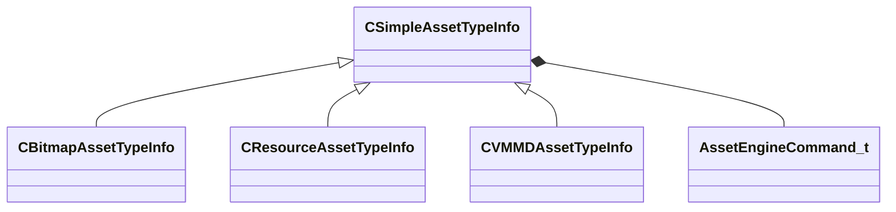

[Schemas](../../schemas.md) / [toolutils2](../toolutils2.md) / CSimpleAssetTypeInfo

# CSimpleAssetTypeInfo

> Source: **Build 25000182** · 2026-08-28 · `windows-x86_64` · schema `0.10.0`

**Kind:** class · **Size:** 256 bytes (`0x100`) · **Align:** 8 · **Module:** toolutils2

**Derived by:** [CBitmapAssetTypeInfo](../toolutils2/CBitmapAssetTypeInfo.md), [CResourceAssetTypeInfo](../toolutils2/CResourceAssetTypeInfo.md), [CVMMDAssetTypeInfo](../toolutils2/CVMMDAssetTypeInfo.md)

**Relationships:**

## Memory layout

24 fields (24 declared here, 0 inherited). Offsets are absolute from the object base.

| Offset | Field | Type | From | Annotations |
|--------|-------|------|------|-------------|
| `0x10` | `m_FriendlyName` | CUtlString |  |  |
| `0x18` | `m_Ext` | CUtlString |  |  |
| `0x20` | `m_IconLg` | CUtlString |  |  |
| `0x28` | `m_IconSm` | CUtlString |  |  |
| `0x30` | `m_SuppressSubstrings` | CUtlVector< CUtlString > |  |  |
| `0x48` | `m_AdditionalExtensions` | CUtlVector< CUtlString > |  |  |
| `0x60` | `m_EngineCommands` | CUtlVector< [AssetEngineCommand_t](../toolutils2/AssetEngineCommand_t.md) > |  |  |
| `0x78` | `m_LimitToMods` | CUtlVector< CUtlString > |  |  |
| `0x90` | `m_ExcludeFromMods` | CUtlVector< CUtlString > |  |  |
| `0xa8` | `m_HideForRetailMods` | CUtlVector< CUtlString > |  |  |
| `0xc0` | `m_PreviewThumbnailOverlayIcon` | CUtlString |  |  |
| `0xc8` | `m_bErrorOnUnrecognizedOutboundRefs` | bool |  |  |
| `0xd0` | `m_UnrecognizedOutboundRefsErrorTypeExceptions` | CUtlVector< CUtlString > |  |  |
| `0xe8` | `m_bHideTypeByDefault` | bool |  |  |
| `0xe9` | `m_bCannotBeShown` | bool |  |  |
| `0xea` | `m_bIsNontrivialChildAssetType` | bool |  |  |
| `0xeb` | `m_bSuppressFullFingerprintCalculation` | bool |  |  |
| `0xec` | `m_bIgnoreCompiledState` | bool |  |  |
| `0xed` | `m_bContentFileIsText` | bool |  |  |
| `0xee` | `m_bPrefersLivePreview` | bool |  |  |
| `0xef` | `m_bPresentInGameTree` | bool |  |  |
| `0xf0` | `m_bShouldCompileErrorFallbackToDisk` | bool |  |  |
| `0xf4` | `m_nAssetTypeVersion` | int32 |  |  |
| `0xf8` | `m_Test_InjectSearchable` | CUtlString |  |  |

KV3 class defaults

<pre>{
	&quot;_class&quot;: &quot;CSimpleAssetTypeInfo&quot;,
	&quot;m_FriendlyName&quot;: &quot;&quot;,
	&quot;m_Ext&quot;: &quot;&quot;,
	&quot;m_IconLg&quot;: &quot;game:tools/images/assettypes/generic_lg.png&quot;,
	&quot;m_IconSm&quot;: &quot;game:tools/images/assettypes/generic_sm.png&quot;,
	&quot;m_SuppressSubstrings&quot;:
	[
	],
	&quot;m_AdditionalExtensions&quot;:
	[
	],
	&quot;m_EngineCommands&quot;:
	[
	],
	&quot;m_LimitToMods&quot;:
	[
	],
	&quot;m_ExcludeFromMods&quot;:
	[
	],
	&quot;m_HideForRetailMods&quot;:
	[
	],
	&quot;m_PreviewThumbnailOverlayIcon&quot;: &quot;&quot;,
	&quot;m_bErrorOnUnrecognizedOutboundRefs&quot;: false,
	&quot;m_UnrecognizedOutboundRefsErrorTypeExceptions&quot;:
	[
	],
	&quot;m_bHideTypeByDefault&quot;: false,
	&quot;m_bCannotBeShown&quot;: false,
	&quot;m_bIsNontrivialChildAssetType&quot;: false,
	&quot;m_bSuppressFullFingerprintCalculation&quot;: false,
	&quot;m_bIgnoreCompiledState&quot;: false,
	&quot;m_bContentFileIsText&quot;: false,
	&quot;m_bPrefersLivePreview&quot;: false,
	&quot;m_bPresentInGameTree&quot;: false,
	&quot;m_bShouldCompileErrorFallbackToDisk&quot;: false,
	&quot;m_nAssetTypeVersion&quot;: 0,
	&quot;m_Test_InjectSearchable&quot;: &quot;&quot;
}</pre>

