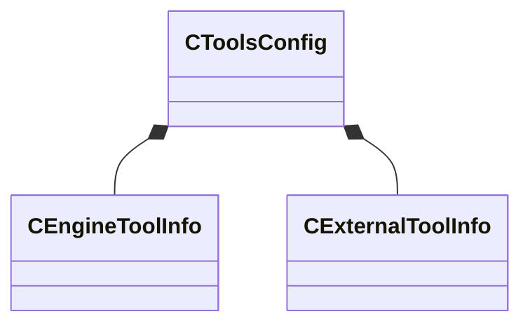

[Schemas](../../schemas.md) / [toolutils2](../toolutils2.md) / CToolsConfig

# CToolsConfig

> Source: **Build 25000182** · 2026-08-28 · `windows-x86_64` · schema `0.10.0`

**Kind:** class · **Size:** 72 bytes (`0x48`) · **Align:** 8 · **Module:** toolutils2

**Relationships:**

## Memory layout

3 fields (3 declared here, 0 inherited). Offsets are absolute from the object base.

| Offset | Field | Type | From | Annotations |
|--------|-------|------|------|-------------|
| `0x0` | `m_EngineTools` | CUtlVector< [CEngineToolInfo](../toolutils2/CEngineToolInfo.md) > |  |  |
| `0x18` | `m_ExternalTools` | CUtlVector< [CExternalToolInfo](../toolutils2/CExternalToolInfo.md) > |  |  |
| `0x30` | `m_EngineModulesThatReferenceAssets` | CUtlVector< CUtlString > |  |  |

KV3 class defaults

<pre>{
	&quot;m_EngineTools&quot;:
	[
	],
	&quot;m_ExternalTools&quot;:
	[
	],
	&quot;m_EngineModulesThatReferenceAssets&quot;:
	[
	]
}</pre>

