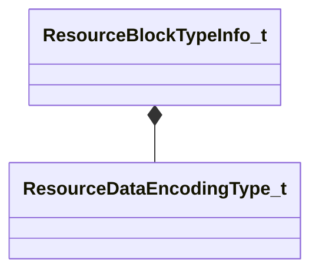

[Schemas](../../schemas.md) / [toolutils2](../toolutils2.md) / ResourceBlockTypeInfo_t

# ResourceBlockTypeInfo_t

> Source: **Build 25000182** · 2026-08-28 · `windows-x86_64` · schema `0.10.0`

**Kind:** class · **Size:** 32 bytes (`0x20`) · **Align:** 8 · **Module:** toolutils2

**Relationships:**

## Memory layout

4 fields (4 declared here, 0 inherited). Offsets are absolute from the object base.

| Offset | Field | Type | From | Annotations |
|--------|-------|------|------|-------------|
| `0x0` | `m_Encoding` | [ResourceDataEncodingType_t](../toolutils2/ResourceDataEncodingType_t.md) |  |  |
| `0x8` | `m_BlockID` | CUtlString |  |  |
| `0x10` | `m_IntrospectedRootStruct` | CUtlString |  |  |
| `0x18` | `m_ResourceVersion` | int32 |  |  |

KV3 class defaults

<pre>{
	&quot;m_Encoding&quot;: &quot;RESOURCE_ENCODING_INTROSPECTED&quot;,
	&quot;m_BlockID&quot;: &quot;&quot;,
	&quot;m_IntrospectedRootStruct&quot;: &quot;&quot;,
	&quot;m_ResourceVersion&quot;: -1
}</pre>

