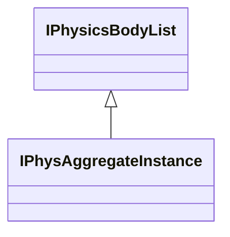
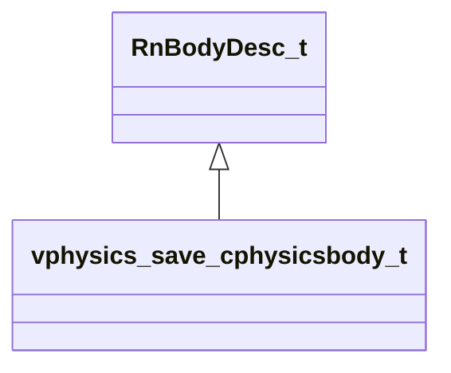

# Module: vphysics2

[📊 View UML Diagram](../diagrams/vphysics2.md)

| Name | Kind | Bases | Fields |
|------|------|-------|--------|
| [IPhysAggregateInstance](#iphysaggregateinstance) | class | IPhysicsBodyList | 2 |
| [IPhysicsBody](#iphysicsbody) | class |  | 0 |
| [IPhysicsBodyList](#iphysicsbodylist) | class |  | 0 |
| [IPhysicsJoint](#iphysicsjoint) | class |  | 0 |
| [IPhysicsMotionController](#iphysicsmotioncontroller) | class |  | 0 |
| [IPhysicsParticleRope](#iphysicsparticlerope) | class |  | 0 |
| [IPhysicsPlayerController](#iphysicsplayercontroller) | class |  | 0 |
| [IPhysicsRagdollControl](#iphysicsragdollcontrol) | class |  | 0 |
| [VPhysEntityId_t](#vphysentityid_t) | class |  | 1 |
| [constraint_axislimit_t](#constraint_axislimit_t) | class |  | 4 |
| [constraint_breakableparams_t](#constraint_breakableparams_t) | class |  | 5 |
| [constraint_hingeparams_t](#constraint_hingeparams_t) | class |  | 4 |
| [vphysics_save_cphysicsbody_t](#vphysics_save_cphysicsbody_t) | class | RnBodyDesc_t | 1 |
| [vphysics_save_ragdoll_control_t](#vphysics_save_ragdoll_control_t) | class |  | 10 |

---

### IPhysAggregateInstance

**Inherits from:** [IPhysicsBodyList](vphysics2.md#iphysicsbodylist)

**Relationships:**

**Fields:**

| Name | Type | Annotations |
|------|------|-------------|
| `m_pSkeleton` | void* |  |
| `m_bIsAxisAligned` | bool |  |

### IPhysicsBody

### IPhysicsBodyList

**Derived by:** [IPhysAggregateInstance](vphysics2.md#iphysaggregateinstance)

**Relationships:**

### IPhysicsJoint

### IPhysicsMotionController

### IPhysicsParticleRope

### IPhysicsPlayerController

### IPhysicsRagdollControl

### VPhysEntityId_t

**Metadata:** `MGetKV3ClassDefaults`

**Fields:**

| Name | Type | Annotations |
|------|------|-------------|
| `m_Id` | uint32 |  |

### constraint_axislimit_t

**Fields:**

| Name | Type | Annotations |
|------|------|-------------|
| `flMinRotation` | float32 |  |
| `flMaxRotation` | float32 |  |
| `flMotorTargetAngSpeed` | float32 |  |
| `flMotorMaxTorque` | float32 |  |

### constraint_breakableparams_t

**Fields:**

| Name | Type | Annotations |
|------|------|-------------|
| `strength` | float32 |  |
| `forceLimit` | float32 |  |
| `torqueLimit` | float32 |  |
| `bodyMassScale` | float32[2] |  |
| `isActive` | bool |  |

### constraint_hingeparams_t

**Metadata:** `MGetKV3ClassDefaults`

**Fields:**

| Name | Type | Annotations |
|------|------|-------------|
| `worldPosition` | VectorWS |  |
| `worldAxisDirection` | Vector |  |
| `hingeAxis` | constraint_axislimit_t | `MNotSaved` |
| `constraint` | constraint_breakableparams_t | `MNotSaved` |

### vphysics_save_cphysicsbody_t

**Inherits from:** [RnBodyDesc_t](physicslib.md#rnbodydesc_t)

**Metadata:** `MGetKV3ClassDefaults`

**Relationships:**

**Fields:**

| Name | Type | Annotations |
|------|------|-------------|
| `m_nOldPointer` | uint64 |  |

### vphysics_save_ragdoll_control_t

**Metadata:** `MGetKV3ClassDefaults`

**Fields:**

| Name | Type | Annotations |
|------|------|-------------|
| `m_flMinSpringFrequency` | float32 |  |
| `m_flMaxSpringFrequency` | float32 |  |
| `m_flMaxStretch` | float32 |  |
| `m_bSolidCollisionAtZeroWeight` | bool |  |
| `m_bRequiresDynamicBodies` | bool |  |
| `m_bIgnoreTeleport` | bool |  |
| `m_vLinearVelocityAccumulator` | Vector |  |
| `m_vAngularVelocityAccumulator` | RotationVector |  |
| `m_vForceAccumulator` | Vector |  |
| `m_nBodyCount` | int32 |  |
