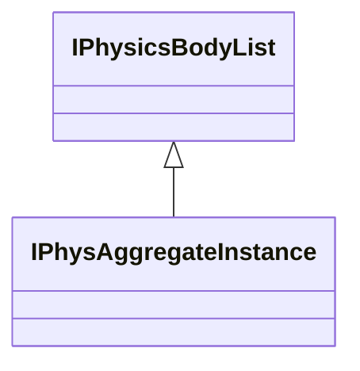

[Schemas](../../schemas.md) / [vphysics2](../vphysics2.md) / IPhysAggregateInstance

# IPhysAggregateInstance

> Source: **Build 25000182** · 2026-08-28 · `windows-x86_64` · schema `0.10.0`

**Kind:** class · **Size:** 24 bytes (`0x18`) · **Align:** n/a (unspecified) · **Module:** vphysics2

**Inherits from:** [IPhysicsBodyList](../vphysics2/IPhysicsBodyList.md)

**Relationships:**

## Memory layout

2 fields (2 declared here, 0 inherited). Offsets are absolute from the object base.

| Offset | Field | Type | From | Annotations |
|--------|-------|------|------|-------------|
| `0x8` | `m_pSkeleton` | void* |  |  |
| `0x10` | `m_bIsAxisAligned` | bool |  |  |
