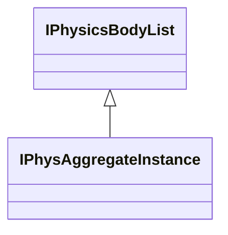

[Schemas](../../schemas.md) / [vphysics2](../vphysics2.md) / IPhysicsBodyList

# IPhysicsBodyList

**Kind:** class · **Size:** 8 bytes (`0x8`) · **Align:** 255 · **Module:** vphysics2

**Derived by:** [IPhysAggregateInstance](../vphysics2/IPhysAggregateInstance.md)

**Relationships:**

