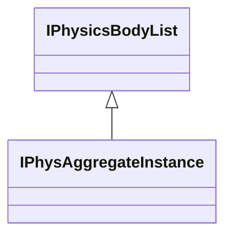

[Schemas](../../schemas.md) / [vphysics2](../vphysics2.md) / IPhysicsBodyList

# IPhysicsBodyList

> Source: **Build 25175329** · 2026-09-07 · `windows-x86_64` · schema `0.10.0`

**Kind:** class · **Size:** 8 bytes (`0x8`) · **Align:** n/a (unspecified) · **Module:** vphysics2

**Derived by:** [IPhysAggregateInstance](../vphysics2/IPhysAggregateInstance.md)

**Relationships:**

```mermaid
classDiagram
    IPhysicsBodyList <|-- IPhysAggregateInstance
```

## Memory layout

No schema-visible fields (8 bytes of opaque storage).
