# Module: worldrenderer

[📊 View UML Diagram](../diagrams/worldrenderer.md)

| Name | Kind | Bases | Fields |
|------|------|-------|--------|
| [AggregateInstanceStreamOnDiskData_t](#aggregateinstancestreamondiskdata_t) | class |  | 2 |
| [AggregateInstanceStream_t](#aggregateinstancestream_t) | enum |  | 4 |
| [AggregateLODSetup_t](#aggregatelodsetup_t) | class |  | 3 |
| [AggregateMeshInfo_t](#aggregatemeshinfo_t) | class |  | 12 |
| [AggregateRTProxySceneObject_t](#aggregatertproxysceneobject_t) | class |  | 6 |
| [AggregateSceneObject_t](#aggregatesceneobject_t) | class |  | 10 |
| [AggregateVertexAlbedoStreamOnDiskData_t](#aggregatevertexalbedostreamondiskdata_t) | class |  | 1 |
| [BakedLightingInfo_t](#bakedlightinginfo_t) | class |  | 11 |
| [BakedLightingInfo_t::BakedShadowAssignment_t](#bakedlightinginfo_tbakedshadowassignment_t) | class |  | 3 |
| [BaseSceneObjectOverride_t](#basesceneobjectoverride_t) | class |  | 1 |
| [CVoxelVisibility](#cvoxelvisibility) | class |  | 13 |
| [ClutterSceneObject_t](#cluttersceneobject_t) | class |  | 11 |
| [ClutterTile_t](#cluttertile_t) | class |  | 3 |
| [EntityIOConnectionData_t](#entityioconnectiondata_t) | class |  | 8 |
| [EntityKeyValueData_t](#entitykeyvaluedata_t) | class |  | 2 |
| [ExtraVertexStreamOverride_t](#extravertexstreamoverride_t) | class | BaseSceneObjectOverride_t | 4 |
| [InfoForResourceTypeVMapResourceData_t](#infoforresourcetypevmapresourcedata_t) | class |  | 0 |
| [MaterialOverride_t](#materialoverride_t) | class | BaseSceneObjectOverride_t | 4 |
| [NodeData_t](#nodedata_t) | class |  | 7 |
| [ObjectTypeFlags_t](#objecttypeflags_t) | enum |  | 16 |
| [PermEntityLumpData_t](#permentitylumpdata_t) | class |  | 3 |
| [RTProxyBLAS_t](#rtproxyblas_t) | class |  | 9 |
| [RTProxyInstanceFlags_t](#rtproxyinstanceflags_t) | enum |  | 2 |
| [RTProxyInstanceInfo_t](#rtproxyinstanceinfo_t) | class |  | 6 |
| [SceneObject_t](#sceneobject_t) | class |  | 14 |
| [VMapResourceData_t](#vmapresourcedata_t) | class |  | 0 |
| [VoxelVisBlockOffset_t](#voxelvisblockoffset_t) | class |  | 2 |
| [WorldBuilderParams_t](#worldbuilderparams_t) | class |  | 6 |
| [WorldNodeOnDiskBufferData_t](#worldnodeondiskbufferdata_t) | class |  | 4 |
| [WorldNode_t](#worldnode_t) | class |  | 15 |
| [World_t](#world_t) | class |  | 4 |

---

### AggregateInstanceStreamOnDiskData_t

**Metadata:** `MGetKV3ClassDefaults {
	"m_DecodedSize": 0,
	"m_BufferData": "[BINARY BLOB]"
}`

**Fields:**

| Name | Type | Annotations |
|------|------|-------------|
| `m_DecodedSize` | uint32 |  |
| `m_BufferData` | CUtlBinaryBlock |  |

### AggregateInstanceStream_t

**Values:**

| Name | Value | Description |
|------|-------|-------------|
| `AGGREGATE_INSTANCE_STREAM_NONE` | 0 |  |
| `AGGREGATE_INSTANCE_STREAM_LIGHTMAPUV_UNORM16` | 1 |  |
| `AGGREGATE_INSTANCE_STREAM_VERTEXTINT_UNORM8` | 2 |  |
| `AGGREGATE_INSTANCE_STREAM_VERTEXBLEND_UNORM8` | 4 |  |

### AggregateLODSetup_t

**Metadata:** `MGetKV3ClassDefaults {
	"m_vLODOrigin":
	[
		0.000000,
		0.000000,
		0.000000
	],
	"m_fMaxObjectScale": 1.000000,
	"m_fSwitchDistances":
	[
	]
}`

**Fields:**

| Name | Type | Annotations |
|------|------|-------------|
| `m_vLODOrigin` | Vector |  |
| `m_fMaxObjectScale` | float32 |  |
| `m_fSwitchDistances` | CUtlVector<float32> |  |

### AggregateMeshInfo_t

**Metadata:** `MGetKV3ClassDefaults {
	"m_nVisClusterMemberOffset": 0,
	"m_nVisClusterMemberCount": 0,
	"m_bHasTransform": false,
	"m_nLODGroupMask": 0,
	"m_nDrawCallIndex": -1,
	"m_nLODSetupIndex": -1,
	"m_vTintColor":
	[
		255,
		255,
		255
	],
	"m_objectFlags": "OBJECT_TYPE_MODEL",
	"m_nLightProbeVolumePrecomputedHandshake": 0,
	"m_nInstanceStreamOffset": 0,
	"m_nVertexAlbedoStreamOffset": 0,
	"m_instanceStreams": "AGGREGATE_INSTANCE_STREAM_NONE"
}`

**Relationships:**

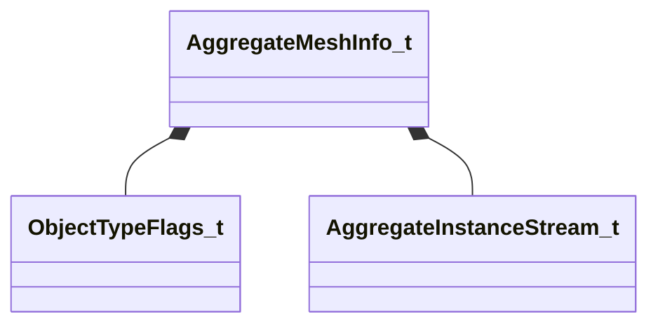

**Fields:**

| Name | Type | Annotations |
|------|------|-------------|
| `m_nVisClusterMemberOffset` | uint32 |  |
| `m_nVisClusterMemberCount` | uint8 |  |
| `m_bHasTransform` | bool |  |
| `m_nLODGroupMask` | uint8 |  |
| `m_nDrawCallIndex` | int16 |  |
| `m_nLODSetupIndex` | int16 |  |
| `m_vTintColor` | Color |  |
| `m_objectFlags` | [ObjectTypeFlags_t](../schemas/worldrenderer.md#objecttypeflags_t) |  |
| `m_nLightProbeVolumePrecomputedHandshake` | int32 |  |
| `m_nInstanceStreamOffset` | uint32 |  |
| `m_nVertexAlbedoStreamOffset` | uint32 |  |
| `m_instanceStreams` | [AggregateInstanceStream_t](../schemas/worldrenderer.md#aggregateinstancestream_t) |  |

### AggregateRTProxySceneObject_t

**Metadata:** `MGetKV3ClassDefaults {
	"m_nLayer": 0,
	"m_BLASes":
	[
	],
	"m_Instances":
	[
	],
	"m_VBData": "[BINARY BLOB]",
	"m_IBData": "[BINARY BLOB]",
	"m_InstanceAlbedoData": "[BINARY BLOB]"
}`

**Relationships:**

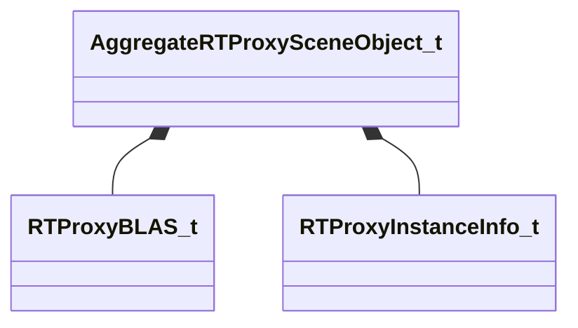

**Fields:**

| Name | Type | Annotations |
|------|------|-------------|
| `m_nLayer` | int16 |  |
| `m_BLASes` | CUtlVector<[RTProxyBLAS_t](../schemas/worldrenderer.md#rtproxyblas_t)> |  |
| `m_Instances` | CUtlVector<[RTProxyInstanceInfo_t](../schemas/worldrenderer.md#rtproxyinstanceinfo_t)> |  |
| `m_VBData` | CUtlBinaryBlock |  |
| `m_IBData` | CUtlBinaryBlock |  |
| `m_InstanceAlbedoData` | CUtlBinaryBlock |  |

### AggregateSceneObject_t

**Metadata:** `MGetKV3ClassDefaults {
	"m_allFlags": "OBJECT_TYPE_NONE",
	"m_anyFlags": "OBJECT_TYPE_NONE",
	"m_nLayer": 0,
	"m_instanceStream": -1,
	"m_vertexAlbedoStream": -1,
	"m_aggregateMeshes":
	[
	],
	"m_lodSetups":
	[
	],
	"m_visClusterMembership":
	[
	],
	"m_fragmentTransforms":
	[
	],
	"m_renderableModel": ""
}`

**Relationships:**

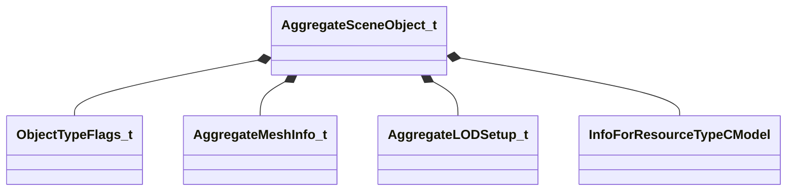

**Fields:**

| Name | Type | Annotations |
|------|------|-------------|
| `m_allFlags` | [ObjectTypeFlags_t](../schemas/worldrenderer.md#objecttypeflags_t) |  |
| `m_anyFlags` | [ObjectTypeFlags_t](../schemas/worldrenderer.md#objecttypeflags_t) |  |
| `m_nLayer` | int16 |  |
| `m_instanceStream` | int16 |  |
| `m_vertexAlbedoStream` | int16 |  |
| `m_aggregateMeshes` | CUtlVector<[AggregateMeshInfo_t](../schemas/worldrenderer.md#aggregatemeshinfo_t)> |  |
| `m_lodSetups` | CUtlVector<[AggregateLODSetup_t](../schemas/worldrenderer.md#aggregatelodsetup_t)> |  |
| `m_visClusterMembership` | CUtlVector<uint16> |  |
| `m_fragmentTransforms` | CUtlVector<matrix3x4_t> |  |
| `m_renderableModel` | CStrongHandle<[InfoForResourceTypeCModel](../schemas/resourcesystem.md#infoforresourcetypecmodel)> |  |

### AggregateVertexAlbedoStreamOnDiskData_t

**Metadata:** `MGetKV3ClassDefaults {
	"m_BufferData": "[BINARY BLOB]"
}`

**Fields:**

| Name | Type | Annotations |
|------|------|-------------|
| `m_BufferData` | CUtlBinaryBlock |  |

### BakedLightingInfo_t

**Metadata:** `MGetKV3ClassDefaults {
	"m_nLightmapVersionNumber": 0,
	"m_nLightmapGameVersionNumber": 0,
	"m_vLightmapUvScale":
	[
		1.000000,
		1.000000
	],
	"m_bHasLightmaps": false,
	"m_bBakedShadowsGamma20": false,
	"m_bCompressionEnabled": false,
	"m_bSHLightmaps": false,
	"m_nChartPackIterations": 0,
	"m_nVradQuality": 0,
	"m_lightMaps":
	[
	],
	"m_bakedShadows":
	[
	]
}`

**Relationships:**

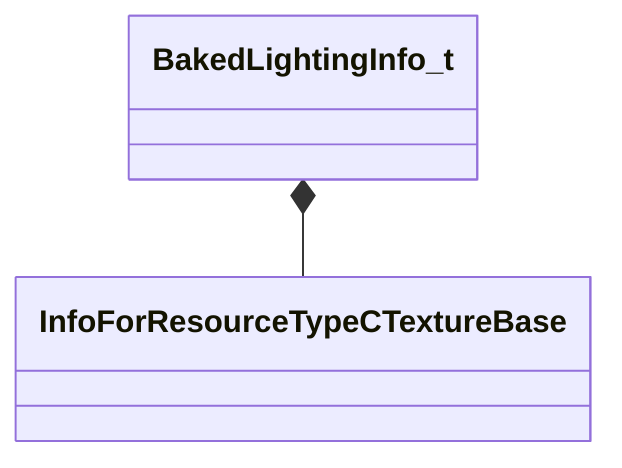

**Fields:**

| Name | Type | Annotations |
|------|------|-------------|
| `m_nLightmapVersionNumber` | uint32 |  |
| `m_nLightmapGameVersionNumber` | uint32 |  |
| `m_vLightmapUvScale` | Vector2D |  |
| `m_bHasLightmaps` | bool |  |
| `m_bBakedShadowsGamma20` | bool |  |
| `m_bCompressionEnabled` | bool |  |
| `m_bSHLightmaps` | bool |  |
| `m_nChartPackIterations` | uint8 |  |
| `m_nVradQuality` | uint8 |  |
| `m_lightMaps` | CUtlVector<CStrongHandle<[InfoForResourceTypeCTextureBase](../schemas/resourcesystem.md#infoforresourcetypectexturebase)>> |  |
| `m_bakedShadows` | CUtlVector<[BakedLightingInfo_t](../schemas/worldrenderer.md#bakedlightinginfo_t)::BakedShadowAssignment_t> |  |

### BakedLightingInfo_t::BakedShadowAssignment_t

**Metadata:** `MGetKV3ClassDefaults {
	"m_nLightHash": 0,
	"m_nMapHash": 0,
	"m_nShadowChannel": -1
}`

**Fields:**

| Name | Type | Annotations |
|------|------|-------------|
| `m_nLightHash` | uint32 |  |
| `m_nMapHash` | uint32 |  |
| `m_nShadowChannel` | int8 |  |

### BaseSceneObjectOverride_t

**Derived by:** [ExtraVertexStreamOverride_t](worldrenderer.md#extravertexstreamoverride_t), [MaterialOverride_t](worldrenderer.md#materialoverride_t)

**Metadata:** `MGetKV3ClassDefaults {
	"m_nSceneObjectIndex": 0
}`

**Relationships:**

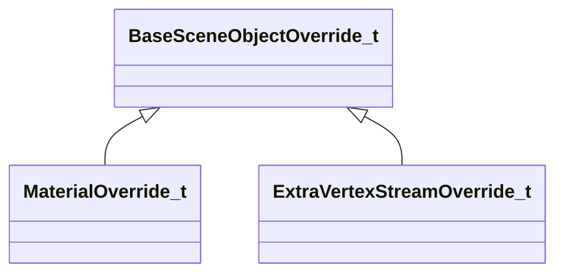

**Fields:**

| Name | Type | Annotations |
|------|------|-------------|
| `m_nSceneObjectIndex` | uint32 |  |

### CVoxelVisibility

**Metadata:** `MGetKV3ClassDefaults {
	"m_nBaseClusterCount": 0,
	"m_nPVSBytesPerCluster": 0,
	"m_vMinBounds":
	[
		0.000000,
		0.000000,
		0.000000
	],
	"m_vMaxBounds":
	[
		0.000000,
		0.000000,
		0.000000
	],
	"m_flGridSize": 0.000000,
	"m_nSkyVisibilityCluster": 0,
	"m_nSunVisibilityCluster": 0,
	"m_NodeBlock":
	{
		"m_nOffset": 0,
		"m_nElementCount": 0
	},
	"m_RegionBlock":
	{
		"m_nOffset": 0,
		"m_nElementCount": 0
	},
	"m_EnclosedClusterListBlock":
	{
		"m_nOffset": 0,
		"m_nElementCount": 0
	},
	"m_EnclosedClustersBlock":
	{
		"m_nOffset": 0,
		"m_nElementCount": 0
	},
	"m_MasksBlock":
	{
		"m_nOffset": 0,
		"m_nElementCount": 0
	},
	"m_nVisBlocks":
	{
		"m_nOffset": 0,
		"m_nElementCount": 0
	}
}`

**Relationships:**

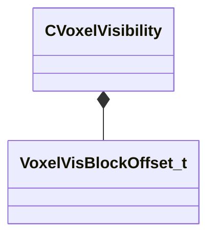

**Fields:**

| Name | Type | Annotations |
|------|------|-------------|
| `m_nBaseClusterCount` | uint32 |  |
| `m_nPVSBytesPerCluster` | uint32 |  |
| `m_vMinBounds` | Vector |  |
| `m_vMaxBounds` | Vector |  |
| `m_flGridSize` | float32 |  |
| `m_nSkyVisibilityCluster` | uint32 |  |
| `m_nSunVisibilityCluster` | uint32 |  |
| `m_NodeBlock` | [VoxelVisBlockOffset_t](../schemas/worldrenderer.md#voxelvisblockoffset_t) |  |
| `m_RegionBlock` | [VoxelVisBlockOffset_t](../schemas/worldrenderer.md#voxelvisblockoffset_t) |  |
| `m_EnclosedClusterListBlock` | [VoxelVisBlockOffset_t](../schemas/worldrenderer.md#voxelvisblockoffset_t) |  |
| `m_EnclosedClustersBlock` | [VoxelVisBlockOffset_t](../schemas/worldrenderer.md#voxelvisblockoffset_t) |  |
| `m_MasksBlock` | [VoxelVisBlockOffset_t](../schemas/worldrenderer.md#voxelvisblockoffset_t) |  |
| `m_nVisBlocks` | [VoxelVisBlockOffset_t](../schemas/worldrenderer.md#voxelvisblockoffset_t) |  |

### ClutterSceneObject_t

**Metadata:** `MGetKV3ClassDefaults {
	"m_Bounds":
	{
		"m_vMinBounds":
		[
			0.000000,
			0.000000,
			0.000000
		],
		"m_vMaxBounds":
		[
			0.000000,
			0.000000,
			0.000000
		]
	},
	"m_flags": "OBJECT_TYPE_NONE",
	"m_nLayer": 0,
	"m_instancePositions":
	[
	],
	"m_instanceScales":
	[
	],
	"m_instanceTintSrgb":
	[
	],
	"m_tiles":
	[
	],
	"m_renderableModel": "",
	"m_materialGroup": "",
	"m_flBeginCullSize": 0.020000,
	"m_flEndCullSize": 0.012500,
	"m_InstanceOrientations32":
	[
	]
}`

**Relationships:**

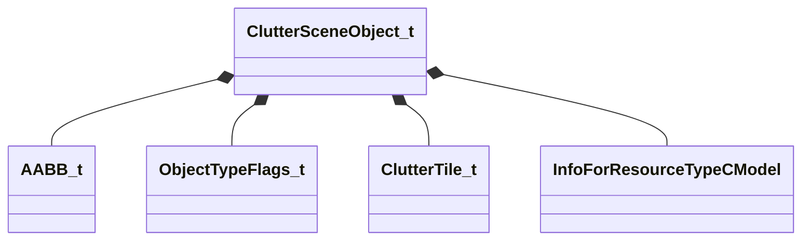

**Fields:**

| Name | Type | Annotations |
|------|------|-------------|
| `m_Bounds` | [AABB_t](../schemas/mathlib_extended.md#aabb_t) |  |
| `m_flags` | [ObjectTypeFlags_t](../schemas/worldrenderer.md#objecttypeflags_t) |  |
| `m_nLayer` | int16 |  |
| `m_instancePositions` | CUtlVector<Vector> |  |
| `m_instanceScales` | CUtlVector<float32> |  |
| `m_instanceTintSrgb` | CUtlVector<Color> |  |
| `m_tiles` | CUtlVector<[ClutterTile_t](../schemas/worldrenderer.md#cluttertile_t)> |  |
| `m_renderableModel` | CStrongHandle<[InfoForResourceTypeCModel](../schemas/resourcesystem.md#infoforresourcetypecmodel)> |  |
| `m_materialGroup` | CUtlStringToken |  |
| `m_flBeginCullSize` | float32 |  |
| `m_flEndCullSize` | float32 |  |

### ClutterTile_t

**Metadata:** `MGetKV3ClassDefaults {
	"m_nFirstInstance": 0,
	"m_nLastInstance": 0,
	"m_BoundsWs":
	{
		"m_vMinBounds":
		[
			0.000000,
			0.000000,
			0.000000
		],
		"m_vMaxBounds":
		[
			0.000000,
			0.000000,
			0.000000
		]
	}
}`

**Relationships:**

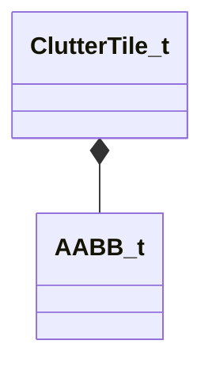

**Fields:**

| Name | Type | Annotations |
|------|------|-------------|
| `m_nFirstInstance` | uint32 |  |
| `m_nLastInstance` | uint32 |  |
| `m_BoundsWs` | [AABB_t](../schemas/mathlib_extended.md#aabb_t) |  |

### EntityIOConnectionData_t

**Metadata:** `MGetKV3ClassDefaults {
	"m_outputName": "",
	"m_targetType": 0,
	"m_targetName": "",
	"m_inputName": "",
	"m_overrideParam": "",
	"m_flDelay": 0.000000,
	"m_nTimesToFire": 0,
	"m_paramMap": null
}`

**Fields:**

| Name | Type | Annotations |
|------|------|-------------|
| `m_outputName` | CUtlString |  |
| `m_targetType` | uint32 |  |
| `m_targetName` | CUtlString |  |
| `m_inputName` | CUtlString |  |
| `m_overrideParam` | CUtlString |  |
| `m_flDelay` | float32 |  |
| `m_nTimesToFire` | int32 |  |
| `m_paramMap` | KeyValues3 |  |

### EntityKeyValueData_t

**Metadata:** `MGetKV3ClassDefaults {
	"m_connections":
	[
	],
	"m_keyValuesData": "[BINARY BLOB]"
}`

**Relationships:**

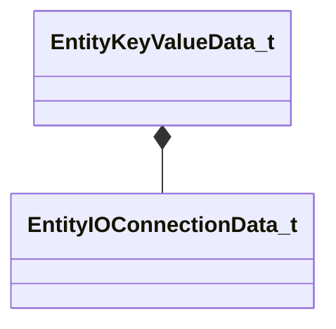

**Fields:**

| Name | Type | Annotations |
|------|------|-------------|
| `m_connections` | CUtlVector<[EntityIOConnectionData_t](../schemas/worldrenderer.md#entityioconnectiondata_t)> |  |
| `m_keyValuesData` | CUtlBinaryBlock |  |

### ExtraVertexStreamOverride_t

**Inherits from:** [BaseSceneObjectOverride_t](worldrenderer.md#basesceneobjectoverride_t)

**Metadata:** `MGetKV3ClassDefaults {
	"m_nSceneObjectIndex": 0,
	"m_nSubSceneObject": 0,
	"m_nDrawCallIndex": 0,
	"m_nAdditionalMeshDrawPrimitiveFlags": "MESH_DRAW_FLAGS_NONE",
	"m_extraBufferBinding":
	{
		"m_hBuffer": 0,
		"m_nBindOffsetBytes": 0
	}
}`

**Relationships:**

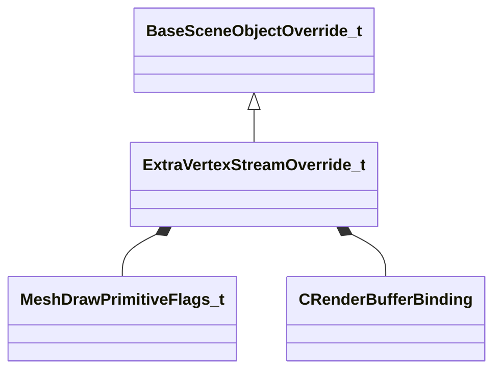

**Fields:**

| Name | Type | Annotations |
|------|------|-------------|
| `m_nSubSceneObject` | uint32 |  |
| `m_nDrawCallIndex` | uint32 |  |
| `m_nAdditionalMeshDrawPrimitiveFlags` | [MeshDrawPrimitiveFlags_t](../schemas/modellib.md#meshdrawprimitiveflags_t) |  |
| `m_extraBufferBinding` | [CRenderBufferBinding](../schemas/modellib.md#crenderbufferbinding) |  |

### InfoForResourceTypeVMapResourceData_t

**Metadata:** `MResourceTypeForInfoType "vmap"`

### MaterialOverride_t

**Inherits from:** [BaseSceneObjectOverride_t](worldrenderer.md#basesceneobjectoverride_t)

**Metadata:** `MGetKV3ClassDefaults {
	"m_nSceneObjectIndex": 0,
	"m_nSubSceneObject": 0,
	"m_nDrawCallIndex": 0,
	"m_pMaterial": "",
	"m_vLinearTintColor":
	[
		1.000000,
		1.000000,
		1.000000
	]
}`

**Relationships:**

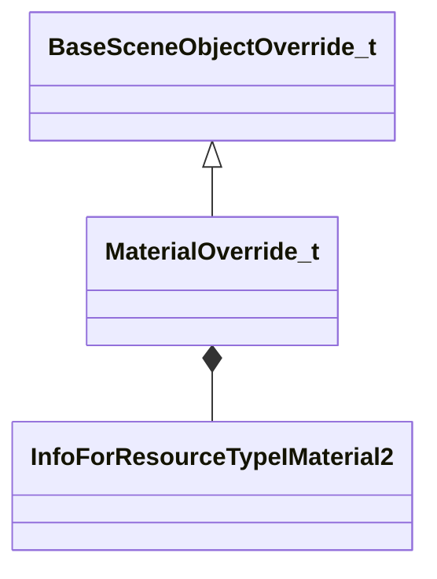

**Fields:**

| Name | Type | Annotations |
|------|------|-------------|
| `m_nSubSceneObject` | uint32 |  |
| `m_nDrawCallIndex` | uint32 |  |
| `m_pMaterial` | CStrongHandle<[InfoForResourceTypeIMaterial2](../schemas/resourcesystem.md#infoforresourcetypeimaterial2)> |  |
| `m_vLinearTintColor` | Vector |  |

### NodeData_t

**Metadata:** `MGetKV3ClassDefaults {
	"m_nParent": 0,
	"m_vOrigin":
	[
		0.000000,
		0.000000,
		0.000000
	],
	"m_vMinBounds":
	[
		0.000000,
		0.000000,
		0.000000
	],
	"m_vMaxBounds":
	[
		0.000000,
		0.000000,
		0.000000
	],
	"m_flMinimumDistance": 0.000000,
	"m_ChildNodeIndices":
	[
	],
	"m_worldNodePrefix": ""
}`

**Fields:**

| Name | Type | Annotations |
|------|------|-------------|
| `m_nParent` | int32 |  |
| `m_vOrigin` | Vector |  |
| `m_vMinBounds` | Vector |  |
| `m_vMaxBounds` | Vector |  |
| `m_flMinimumDistance` | float32 |  |
| `m_ChildNodeIndices` | CUtlVector<int32> |  |
| `m_worldNodePrefix` | CUtlString |  |

### ObjectTypeFlags_t

**Values:**

| Name | Value | Description |
|------|-------|-------------|
| `OBJECT_TYPE_NONE` | 0 |  |
| `OBJECT_TYPE_MODEL` | 8 |  |
| `OBJECT_TYPE_BLOCK_LIGHT` | 16 |  |
| `OBJECT_TYPE_NO_SHADOWS` | 32 |  |
| `OBJECT_TYPE_WORLDSPACE_TEXURE_BLEND` | 64 |  |
| `OBJECT_TYPE_DISABLED_IN_LOW_QUALITY` | 128 |  |
| `OBJECT_TYPE_RENDER_WITH_DYNAMIC` | 512 |  |
| `OBJECT_TYPE_RENDER_TO_CUBEMAPS` | 1024 |  |
| `OBJECT_TYPE_MODEL_HAS_LODS` | 2048 |  |
| `OBJECT_TYPE_OVERLAY` | 8192 |  |
| `OBJECT_TYPE_PRECOMPUTED_VISMEMBERS` | 16384 |  |
| `OBJECT_TYPE_STATIC_CUBE_MAP` | 32768 |  |
| `OBJECT_TYPE_DISABLE_VIS_CULLING` | 65536 |  |
| `OBJECT_TYPE_BAKED_GEOMETRY` | 131072 |  |
| `OBJECT_TYPE_NEEDS_DYNAMIC_SHADOWS` | 262144 |  |
| `OBJECT_TYPE_HAS_AGGREGATE_RTPROXY` | 524288 |  |

### PermEntityLumpData_t

**Metadata:** `MGetKV3ClassDefaults {
	"m_name": "",
	"m_childLumps":
	[
	],
	"m_entityKeyValues":
	[
	]
}`

**Relationships:**

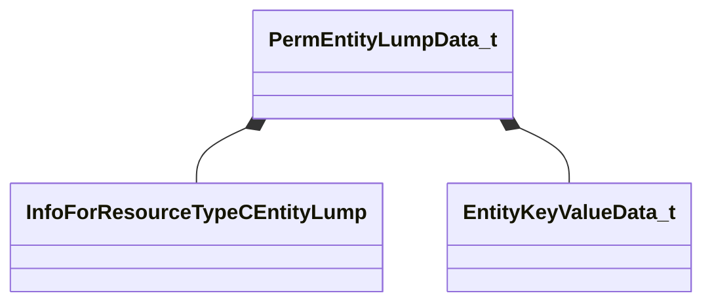

**Fields:**

| Name | Type | Annotations |
|------|------|-------------|
| `m_name` | CUtlString |  |
| `m_childLumps` | CUtlVector<CStrongHandleCopyable<[InfoForResourceTypeCEntityLump](../schemas/resourcesystem.md#infoforresourcetypecentitylump)>> |  |
| `m_entityKeyValues` | CUtlLeanVector<[EntityKeyValueData_t](../schemas/worldrenderer.md#entitykeyvaluedata_t)> |  |

### RTProxyBLAS_t

**Metadata:** `MGetKV3ClassDefaults Could not parse KV3 Defaults`

**Relationships:**

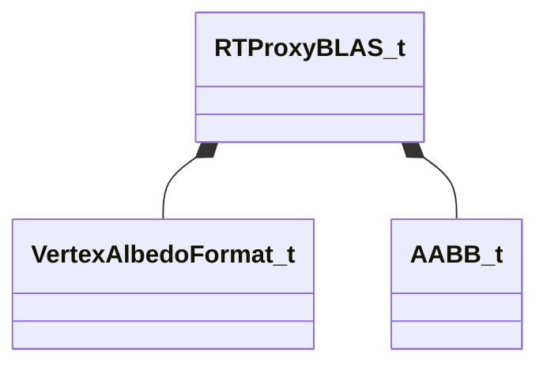

**Fields:**

| Name | Type | Annotations |
|------|------|-------------|
| `m_nFirstIndex` | uint32 |  |
| `m_nIndexCount` | uint32 |  |
| `m_nVBByteOffset` | uint32 |  |
| `m_nBaseVertex` | uint32 |  |
| `m_nVertexCount` | uint16 |  |
| `m_albedoFormat` | [VertexAlbedoFormat_t](../schemas/modellib.md#vertexalbedoformat_t) |  |
| `m_boundLs` | [AABB_t](../schemas/mathlib_extended.md#aabb_t) |  |
| `m_vVertexOriginLs` | Vector |  |
| `m_vVertexExtentLs` | Vector |  |

### RTProxyInstanceFlags_t

**Values:**

| Name | Value | Description |
|------|-------|-------------|
| `RTPROXY_INSTANCE_FLAG_NONE` | 0 |  |
| `RTPROXY_INSTANCE_UNIQUE_MESH` | 1 |  |

### RTProxyInstanceInfo_t

**Metadata:** `MGetKV3ClassDefaults {
	"m_nFlags": "",
	"m_albedoFormat": "VERTEX_ALBEDO_NONE",
	"m_nBLASCount": 0,
	"m_nBLASIndex": 0,
	"m_nVertexAlbedoByteOffset": 0,
	"m_mWorldFromLocal":
	[
		0.000000,
		0.000000,
		0.000000,
		0.000000,
		0.000000,
		0.000000,
		0.000000,
		0.000000,
		0.000000,
		0.000000,
		0.000000,
		0.000000
	]
}`

**Relationships:**

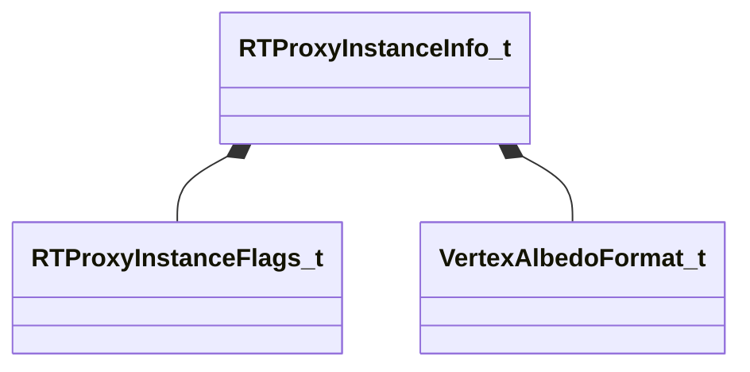

**Fields:**

| Name | Type | Annotations |
|------|------|-------------|
| `m_nFlags` | [RTProxyInstanceFlags_t](../schemas/worldrenderer.md#rtproxyinstanceflags_t) |  |
| `m_albedoFormat` | [VertexAlbedoFormat_t](../schemas/modellib.md#vertexalbedoformat_t) |  |
| `m_nBLASCount` | uint16 |  |
| `m_nBLASIndex` | uint32 |  |
| `m_nVertexAlbedoByteOffset` | uint32 |  |
| `m_mWorldFromLocal` | matrix3x4_t |  |

### SceneObject_t

**Metadata:** `MGetKV3ClassDefaults {
	"m_nObjectID": 0,
	"m_vTransform":
	[
		[
			0.000000,
			0.000000,
			0.000000,
			0.000000
		],
		[
			0.000000,
			0.000000,
			0.000000,
			0.000000
		],
		[
			0.000000,
			0.000000,
			0.000000,
			0.000000
		]
	],
	"m_flFadeStartDistance": 0.000000,
	"m_flFadeEndDistance": 0.000000,
	"m_vTintColor":
	[
		1.000000,
		1.000000,
		1.000000,
		1.000000
	],
	"m_skin": "",
	"m_nObjectTypeFlags": "OBJECT_TYPE_MODEL",
	"m_vLightingOrigin":
	[
		340282346638528859811704183484516925440.000000,
		340282346638528859811704183484516925440.000000,
		340282346638528859811704183484516925440.000000
	],
	"m_nOverlayRenderOrder": 0,
	"m_nLODOverride": -1,
	"m_nCubeMapPrecomputedHandshake": 0,
	"m_nLightProbeVolumePrecomputedHandshake": 0,
	"m_renderableModel": "",
	"m_renderable": ""
}`

**Relationships:**

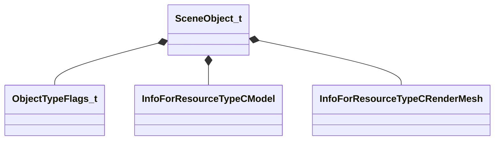

**Fields:**

| Name | Type | Annotations |
|------|------|-------------|
| `m_nObjectID` | uint32 |  |
| `m_vTransform` | Vector4D[3] |  |
| `m_flFadeStartDistance` | float32 |  |
| `m_flFadeEndDistance` | float32 |  |
| `m_vTintColor` | Vector4D |  |
| `m_skin` | CUtlString |  |
| `m_nObjectTypeFlags` | [ObjectTypeFlags_t](../schemas/worldrenderer.md#objecttypeflags_t) |  |
| `m_vLightingOrigin` | Vector |  |
| `m_nOverlayRenderOrder` | int16 |  |
| `m_nLODOverride` | int16 |  |
| `m_nCubeMapPrecomputedHandshake` | int32 |  |
| `m_nLightProbeVolumePrecomputedHandshake` | int32 |  |
| `m_renderableModel` | CStrongHandle<[InfoForResourceTypeCModel](../schemas/resourcesystem.md#infoforresourcetypecmodel)> |  |
| `m_renderable` | CStrongHandle<[InfoForResourceTypeCRenderMesh](../schemas/resourcesystem.md#infoforresourcetypecrendermesh)> |  |

### VMapResourceData_t

### VoxelVisBlockOffset_t

**Metadata:** `MGetKV3ClassDefaults {
	"m_nOffset": 0,
	"m_nElementCount": 4294967295
}`

**Fields:**

| Name | Type | Annotations |
|------|------|-------------|
| `m_nOffset` | uint32 |  |
| `m_nElementCount` | uint32 |  |

### WorldBuilderParams_t

**Metadata:** `MGetKV3ClassDefaults {
	"m_flMinDrawVolumeSize": 0.000000,
	"m_bBuildBakedLighting": false,
	"m_bAggregateInstanceStreams": false,
	"m_bakedLightingInfo":
	{
		"m_nLightmapVersionNumber": 0,
		"m_nLightmapGameVersionNumber": 0,
		"m_vLightmapUvScale":
		[
			1.000000,
			1.000000
		],
		"m_bHasLightmaps": false,
		"m_bBakedShadowsGamma20": false,
		"m_bCompressionEnabled": false,
		"m_bSHLightmaps": false,
		"m_nChartPackIterations": 0,
		"m_nVradQuality": 0,
		"m_lightMaps":
		[
		],
		"m_bakedShadows":
		[
		]
	},
	"m_nCompileTimestamp": 0,
	"m_nCompileFingerprint": 0
}`

**Relationships:**

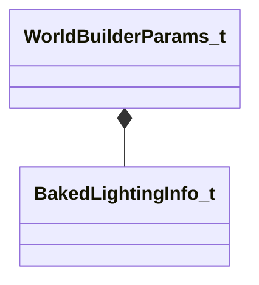

**Fields:**

| Name | Type | Annotations |
|------|------|-------------|
| `m_flMinDrawVolumeSize` | float32 |  |
| `m_bBuildBakedLighting` | bool |  |
| `m_bAggregateInstanceStreams` | bool |  |
| `m_bakedLightingInfo` | [BakedLightingInfo_t](../schemas/worldrenderer.md#bakedlightinginfo_t) |  |
| `m_nCompileTimestamp` | uint64 |  |
| `m_nCompileFingerprint` | uint64 |  |

### WorldNodeOnDiskBufferData_t

**Metadata:** `MGetKV3ClassDefaults {
	"m_nElementCount": 0,
	"m_nElementSizeInBytes": 0,
	"m_inputLayoutFields":
	[
	],
	"m_pData":
	[
	]
}`

**Relationships:**

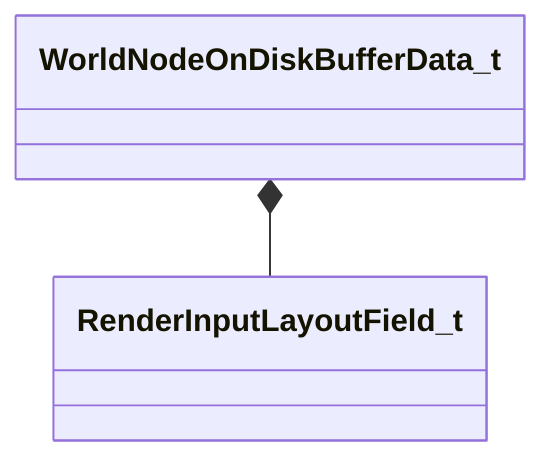

**Fields:**

| Name | Type | Annotations |
|------|------|-------------|
| `m_nElementCount` | int32 |  |
| `m_nElementSizeInBytes` | int32 |  |
| `m_inputLayoutFields` | CUtlVector<[RenderInputLayoutField_t](../schemas/modellib.md#renderinputlayoutfield_t)> |  |
| `m_pData` | CUtlVector<uint8> |  |

### WorldNode_t

**Metadata:** `MGetKV3ClassDefaults {
	"m_sceneObjects":
	[
	],
	"m_visClusterMembership":
	[
	],
	"m_aggregateSceneObjects":
	[
	],
	"m_clutterSceneObjects":
	[
	],
	"m_rtProxies":
	[
	],
	"m_extraVertexStreamOverrides":
	[
	],
	"m_materialOverrides":
	[
	],
	"m_extraVertexStreams":
	[
	],
	"m_aggregateInstanceStreams":
	[
	],
	"m_vertexAlbedoStreams":
	[
	],
	"m_layerNames":
	[
	],
	"m_sceneObjectLayerIndices":
	[
	],
	"m_grassFileName": "",
	"m_nodeLightingInfo":
	{
		"m_nLightmapVersionNumber": 0,
		"m_nLightmapGameVersionNumber": 0,
		"m_vLightmapUvScale":
		[
			1.000000,
			1.000000
		],
		"m_bHasLightmaps": false,
		"m_bBakedShadowsGamma20": false,
		"m_bCompressionEnabled": false,
		"m_bSHLightmaps": false,
		"m_nChartPackIterations": 0,
		"m_nVradQuality": 0,
		"m_lightMaps":
		[
		],
		"m_bakedShadows":
		[
		]
	},
	"m_bHasBakedGeometryFlag": false
}`

**Relationships:**

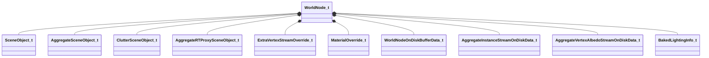

**Fields:**

| Name | Type | Annotations |
|------|------|-------------|
| `m_sceneObjects` | CUtlVector<[SceneObject_t](../schemas/worldrenderer.md#sceneobject_t)> |  |
| `m_visClusterMembership` | CUtlVector<uint16> |  |
| `m_aggregateSceneObjects` | CUtlVector<[AggregateSceneObject_t](../schemas/worldrenderer.md#aggregatesceneobject_t)> |  |
| `m_clutterSceneObjects` | CUtlVector<[ClutterSceneObject_t](../schemas/worldrenderer.md#cluttersceneobject_t)> |  |
| `m_rtProxies` | CUtlVector<[AggregateRTProxySceneObject_t](../schemas/worldrenderer.md#aggregatertproxysceneobject_t)> |  |
| `m_extraVertexStreamOverrides` | CUtlVector<[ExtraVertexStreamOverride_t](../schemas/worldrenderer.md#extravertexstreamoverride_t)> |  |
| `m_materialOverrides` | CUtlVector<[MaterialOverride_t](../schemas/worldrenderer.md#materialoverride_t)> |  |
| `m_extraVertexStreams` | CUtlVector<[WorldNodeOnDiskBufferData_t](../schemas/worldrenderer.md#worldnodeondiskbufferdata_t)> |  |
| `m_aggregateInstanceStreams` | CUtlVector<[AggregateInstanceStreamOnDiskData_t](../schemas/worldrenderer.md#aggregateinstancestreamondiskdata_t)> |  |
| `m_vertexAlbedoStreams` | CUtlVector<[AggregateVertexAlbedoStreamOnDiskData_t](../schemas/worldrenderer.md#aggregatevertexalbedostreamondiskdata_t)> |  |
| `m_layerNames` | CUtlVector<CUtlString> |  |
| `m_sceneObjectLayerIndices` | CUtlVector<uint8> |  |
| `m_grassFileName` | CUtlString |  |
| `m_nodeLightingInfo` | [BakedLightingInfo_t](../schemas/worldrenderer.md#bakedlightinginfo_t) |  |
| `m_bHasBakedGeometryFlag` | bool |  |

### World_t

**Metadata:** `MGetKV3ClassDefaults {
	"m_builderParams":
	{
		"m_flMinDrawVolumeSize": 0.000000,
		"m_bBuildBakedLighting": false,
		"m_bAggregateInstanceStreams": false,
		"m_bakedLightingInfo":
		{
			"m_nLightmapVersionNumber": 0,
			"m_nLightmapGameVersionNumber": 0,
			"m_vLightmapUvScale":
			[
				1.000000,
				1.000000
			],
			"m_bHasLightmaps": false,
			"m_bBakedShadowsGamma20": false,
			"m_bCompressionEnabled": false,
			"m_bSHLightmaps": false,
			"m_nChartPackIterations": 0,
			"m_nVradQuality": 0,
			"m_lightMaps":
			[
			],
			"m_bakedShadows":
			[
			]
		},
		"m_nCompileTimestamp": 0,
		"m_nCompileFingerprint": 0
	},
	"m_worldNodes":
	[
	],
	"m_worldLightingInfo":
	{
		"m_nLightmapVersionNumber": 0,
		"m_nLightmapGameVersionNumber": 0,
		"m_vLightmapUvScale":
		[
			1.000000,
			1.000000
		],
		"m_bHasLightmaps": false,
		"m_bBakedShadowsGamma20": false,
		"m_bCompressionEnabled": false,
		"m_bSHLightmaps": false,
		"m_nChartPackIterations": 0,
		"m_nVradQuality": 0,
		"m_lightMaps":
		[
		],
		"m_bakedShadows":
		[
		]
	},
	"m_entityLumps":
	[
	]
}`

**Relationships:**

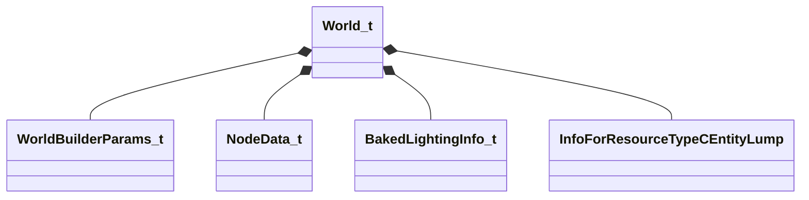

**Fields:**

| Name | Type | Annotations |
|------|------|-------------|
| `m_builderParams` | [WorldBuilderParams_t](../schemas/worldrenderer.md#worldbuilderparams_t) |  |
| `m_worldNodes` | CUtlVector<[NodeData_t](../schemas/worldrenderer.md#nodedata_t)> |  |
| `m_worldLightingInfo` | [BakedLightingInfo_t](../schemas/worldrenderer.md#bakedlightinginfo_t) |  |
| `m_entityLumps` | CUtlVector<CStrongHandleCopyable<[InfoForResourceTypeCEntityLump](../schemas/resourcesystem.md#infoforresourcetypecentitylump)>> |  |
