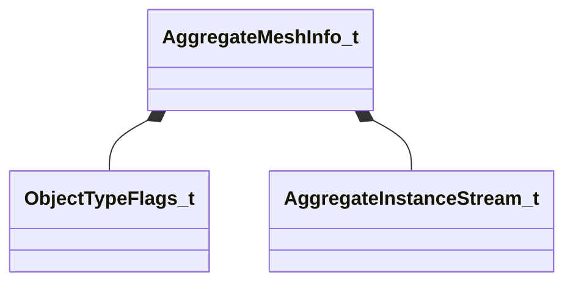

[Schemas](../../schemas.md) / [worldrenderer](../worldrenderer.md) / AggregateMeshInfo_t

# AggregateMeshInfo_t

> Source: **Build 25000182** · 2026-08-28 · `windows-x86_64` · schema `0.10.0`

**Kind:** class · **Size:** 44 bytes (`0x2c`) · **Align:** 4 · **Module:** worldrenderer

**Relationships:**

## Memory layout

14 fields (14 declared here, 0 inherited). Offsets are absolute from the object base.

| Offset | Field | Type | From | Annotations |
|--------|-------|------|------|-------------|
| `0x0` | `m_nVisClusterMemberOffset` | uint32 |  |  |
| `0x4` | `m_nVisClusterMemberCount` | uint8 |  |  |
| `0x5` | `m_bHasTransform` | bool |  |  |
| `0x6` | `m_nLODGroupMask` | uint8 |  |  |
| `0x8` | `m_nDrawCallIndex` | int16 |  |  |
| `0xa` | `m_nLODSetupIndex` | int16 |  |  |
| `0xc` | `m_vTintColor` | Color |  |  |
| `0x10` | `m_objectFlags` | [ObjectTypeFlags_t](../worldrenderer/ObjectTypeFlags_t.md) |  |  |
| `0x14` | `m_nLightProbeVolumePrecomputedHandshake` | int32 |  |  |
| `0x18` | `m_nInstanceStreamOffset` | uint32 |  |  |
| `0x1c` | `m_nVertexAlbedoStreamOffset` | uint32 |  |  |
| `0x20` | `m_nVertexEmissiveStreamOffset` | uint32 |  |  |
| `0x24` | `m_instanceStreams` | [AggregateInstanceStream_t](../worldrenderer/AggregateInstanceStream_t.md) |  |  |
| `0x28` | `m_fEmissiveFactor` | float32 |  |  |

KV3 class defaults

<pre>{
	&quot;m_nVisClusterMemberOffset&quot;: 0,
	&quot;m_nVisClusterMemberCount&quot;: 0,
	&quot;m_bHasTransform&quot;: false,
	&quot;m_nLODGroupMask&quot;: 0,
	&quot;m_nDrawCallIndex&quot;: -1,
	&quot;m_nLODSetupIndex&quot;: -1,
	&quot;m_vTintColor&quot;:
	[
		255,
		255,
		255
	],
	&quot;m_objectFlags&quot;: &quot;OBJECT_TYPE_MODEL&quot;,
	&quot;m_nLightProbeVolumePrecomputedHandshake&quot;: 0,
	&quot;m_nInstanceStreamOffset&quot;: 0,
	&quot;m_nVertexAlbedoStreamOffset&quot;: 0,
	&quot;m_nVertexEmissiveStreamOffset&quot;: 0,
	&quot;m_instanceStreams&quot;: &quot;AGGREGATE_INSTANCE_STREAM_NONE&quot;,
	&quot;m_fEmissiveFactor&quot;: 0.000000
}</pre>

