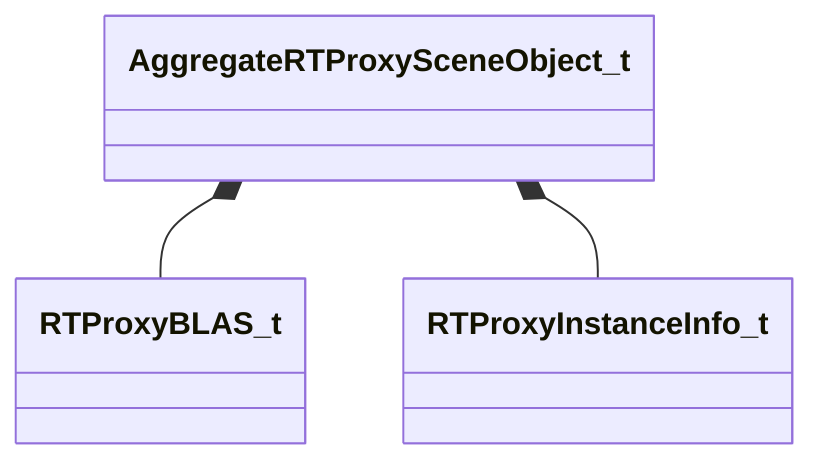

[Schemas](../../schemas.md) / [worldrenderer](../worldrenderer.md) / AggregateRTProxySceneObject_t

# AggregateRTProxySceneObject_t

> Source: **Build 25000182** · 2026-08-28 · `windows-x86_64` · schema `0.10.0`

**Kind:** class · **Size:** 120 bytes (`0x78`) · **Align:** 8 · **Module:** worldrenderer

**Relationships:**

## Memory layout

7 fields (7 declared here, 0 inherited). Offsets are absolute from the object base.

| Offset | Field | Type | From | Annotations |
|--------|-------|------|------|-------------|
| `0x0` | `m_nLayer` | int16 |  |  |
| `0x8` | `m_BLASes` | CUtlVector< [RTProxyBLAS_t](../worldrenderer/RTProxyBLAS_t.md) > |  |  |
| `0x20` | `m_Instances` | CUtlVector< [RTProxyInstanceInfo_t](../worldrenderer/RTProxyInstanceInfo_t.md) > |  |  |
| `0x38` | `m_VBData` | CUtlBinaryBlock |  |  |
| `0x48` | `m_IBData` | CUtlBinaryBlock |  |  |
| `0x58` | `m_InstanceAlbedoData` | CUtlBinaryBlock |  |  |
| `0x68` | `m_InstanceEmissiveData` | CUtlBinaryBlock |  |  |

KV3 class defaults

<pre>{
	&quot;m_nLayer&quot;: 0,
	&quot;m_BLASes&quot;:
	[
	],
	&quot;m_Instances&quot;:
	[
	],
	&quot;m_VBData&quot;: &quot;[BINARY BLOB]&quot;,
	&quot;m_IBData&quot;: &quot;[BINARY BLOB]&quot;,
	&quot;m_InstanceAlbedoData&quot;: &quot;[BINARY BLOB]&quot;,
	&quot;m_InstanceEmissiveData&quot;: &quot;[BINARY BLOB]&quot;
}</pre>

