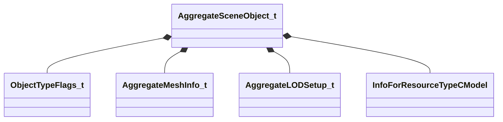

[Schemas](../../schemas.md) / [worldrenderer](../worldrenderer.md) / AggregateSceneObject_t

# AggregateSceneObject_t

> Source: **Build 25000182** · 2026-08-28 · `windows-x86_64` · schema `0.10.0`

**Kind:** class · **Size:** 120 bytes (`0x78`) · **Align:** 8 · **Module:** worldrenderer

**Relationships:**

## Memory layout

11 fields (11 declared here, 0 inherited). Offsets are absolute from the object base.

| Offset | Field | Type | From | Annotations |
|--------|-------|------|------|-------------|
| `0x0` | `m_allFlags` | [ObjectTypeFlags_t](../worldrenderer/ObjectTypeFlags_t.md) |  |  |
| `0x4` | `m_anyFlags` | [ObjectTypeFlags_t](../worldrenderer/ObjectTypeFlags_t.md) |  |  |
| `0x8` | `m_nLayer` | int16 |  |  |
| `0xa` | `m_instanceStream` | int16 |  |  |
| `0xc` | `m_vertexAlbedoStream` | int16 |  |  |
| `0xe` | `m_vertexEmissiveStream` | int16 |  |  |
| `0x10` | `m_aggregateMeshes` | CUtlVector< [AggregateMeshInfo_t](../worldrenderer/AggregateMeshInfo_t.md) > |  |  |
| `0x28` | `m_lodSetups` | CUtlVector< [AggregateLODSetup_t](../worldrenderer/AggregateLODSetup_t.md) > |  |  |
| `0x40` | `m_visClusterMembership` | CUtlVector< uint16 > |  |  |
| `0x58` | `m_fragmentTransforms` | CUtlVector< matrix3x4_t > |  |  |
| `0x70` | `m_renderableModel` | CStrongHandle< [InfoForResourceTypeCModel](../resourcesystem/InfoForResourceTypeCModel.md) > |  |  |

KV3 class defaults

<pre>{
	&quot;m_allFlags&quot;: &quot;OBJECT_TYPE_NONE&quot;,
	&quot;m_anyFlags&quot;: &quot;OBJECT_TYPE_NONE&quot;,
	&quot;m_nLayer&quot;: 0,
	&quot;m_instanceStream&quot;: -1,
	&quot;m_vertexAlbedoStream&quot;: -1,
	&quot;m_vertexEmissiveStream&quot;: -1,
	&quot;m_aggregateMeshes&quot;:
	[
	],
	&quot;m_lodSetups&quot;:
	[
	],
	&quot;m_visClusterMembership&quot;:
	[
	],
	&quot;m_fragmentTransforms&quot;:
	[
	],
	&quot;m_renderableModel&quot;: &quot;&quot;
}</pre>

