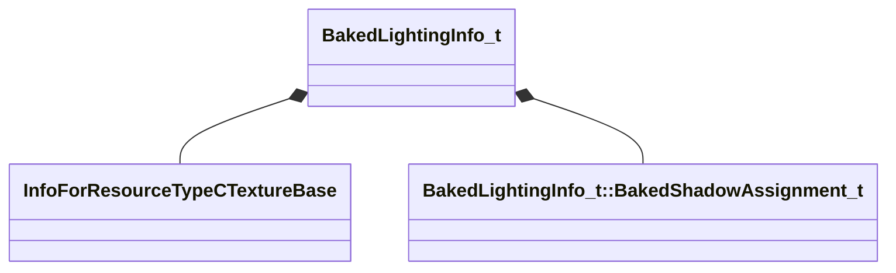

[Schemas](../../schemas.md) / [worldrenderer](../worldrenderer.md) / BakedLightingInfo_t

# BakedLightingInfo_t

> Source: **Build 25000182** · 2026-08-28 · `windows-x86_64` · schema `0.10.0`

**Kind:** class · **Size:** 72 bytes (`0x48`) · **Align:** 8 · **Module:** worldrenderer

**Relationships:**

## Memory layout

11 fields (11 declared here, 0 inherited). Offsets are absolute from the object base.

| Offset | Field | Type | From | Annotations |
|--------|-------|------|------|-------------|
| `0x0` | `m_nLightmapVersionNumber` | uint32 |  |  |
| `0x4` | `m_nLightmapGameVersionNumber` | uint32 |  |  |
| `0x8` | `m_vLightmapUvScale` | Vector2D |  |  |
| `0x10` | `m_bHasLightmaps` | bool |  |  |
| `0x11` | `m_bBakedShadowsGamma20` | bool |  |  |
| `0x12` | `m_bCompressionEnabled` | bool |  |  |
| `0x13` | `m_bSHLightmaps` | bool |  |  |
| `0x14` | `m_nChartPackIterations` | uint8 |  |  |
| `0x15` | `m_nVradQuality` | uint8 |  |  |
| `0x18` | `m_lightMaps` | CUtlVector< CStrongHandle< [InfoForResourceTypeCTextureBase](../resourcesystem/InfoForResourceTypeCTextureBase.md) > > |  |  |
| `0x30` | `m_bakedShadows` | CUtlVector< [BakedLightingInfo_t::BakedShadowAssignment_t](../worldrenderer/BakedLightingInfo_t.BakedShadowAssignment_t.md) > |  |  |

KV3 class defaults

<pre>{
	&quot;m_nLightmapVersionNumber&quot;: 0,
	&quot;m_nLightmapGameVersionNumber&quot;: 0,
	&quot;m_vLightmapUvScale&quot;:
	[
		1.000000,
		1.000000
	],
	&quot;m_bHasLightmaps&quot;: false,
	&quot;m_bBakedShadowsGamma20&quot;: false,
	&quot;m_bCompressionEnabled&quot;: false,
	&quot;m_bSHLightmaps&quot;: false,
	&quot;m_nChartPackIterations&quot;: 0,
	&quot;m_nVradQuality&quot;: 0,
	&quot;m_lightMaps&quot;:
	[
	],
	&quot;m_bakedShadows&quot;:
	[
	]
}</pre>

