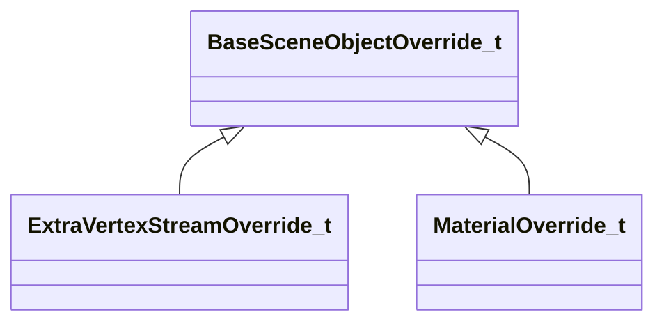

[Schemas](../../schemas.md) / [worldrenderer](../worldrenderer.md) / BaseSceneObjectOverride_t

# BaseSceneObjectOverride_t

**Kind:** class · **Size:** 4 bytes (`0x4`) · **Align:** 4 · **Module:** worldrenderer

**Derived by:** [ExtraVertexStreamOverride_t](../worldrenderer/ExtraVertexStreamOverride_t.md), [MaterialOverride_t](../worldrenderer/MaterialOverride_t.md)

**Relationships:**

## Memory layout

1 fields (1 declared here, 0 inherited). Offsets are absolute from the object base.

| Offset | Field | Type | From | Annotations |
|--------|-------|------|------|-------------|
| `0x0` | `m_nSceneObjectIndex` | uint32 |  |  |

KV3 class defaults

<pre>{
	&quot;m_nSceneObjectIndex&quot;: 0
}</pre>

