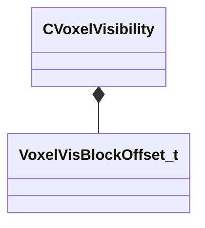

[Schemas](../../schemas.md) / [worldrenderer](../worldrenderer.md) / CVoxelVisibility

# CVoxelVisibility

> Source: **Build 25000182** · 2026-08-28 · `windows-x86_64` · schema `0.10.0`

**Kind:** class · **Size:** 160 bytes (`0xa0`) · **Align:** 8 · **Module:** worldrenderer

**Relationships:**

## Memory layout

13 fields (13 declared here, 0 inherited). Offsets are absolute from the object base.

| Offset | Field | Type | From | Annotations |
|--------|-------|------|------|-------------|
| `0x40` | `m_nBaseClusterCount` | uint32 |  |  |
| `0x44` | `m_nPVSBytesPerCluster` | uint32 |  |  |
| `0x48` | `m_vMinBounds` | Vector |  |  |
| `0x54` | `m_vMaxBounds` | Vector |  |  |
| `0x60` | `m_flGridSize` | float32 |  |  |
| `0x64` | `m_nSkyVisibilityCluster` | uint32 |  |  |
| `0x68` | `m_nSunVisibilityCluster` | uint32 |  |  |
| `0x6c` | `m_NodeBlock` | [VoxelVisBlockOffset_t](../worldrenderer/VoxelVisBlockOffset_t.md) |  |  |
| `0x74` | `m_RegionBlock` | [VoxelVisBlockOffset_t](../worldrenderer/VoxelVisBlockOffset_t.md) |  |  |
| `0x7c` | `m_EnclosedClusterListBlock` | [VoxelVisBlockOffset_t](../worldrenderer/VoxelVisBlockOffset_t.md) |  |  |
| `0x84` | `m_EnclosedClustersBlock` | [VoxelVisBlockOffset_t](../worldrenderer/VoxelVisBlockOffset_t.md) |  |  |
| `0x8c` | `m_MasksBlock` | [VoxelVisBlockOffset_t](../worldrenderer/VoxelVisBlockOffset_t.md) |  |  |
| `0x94` | `m_nVisBlocks` | [VoxelVisBlockOffset_t](../worldrenderer/VoxelVisBlockOffset_t.md) |  |  |

KV3 class defaults

<pre>{
	&quot;m_nBaseClusterCount&quot;: 0,
	&quot;m_nPVSBytesPerCluster&quot;: 0,
	&quot;m_vMinBounds&quot;:
	[
		0.000000,
		0.000000,
		0.000000
	],
	&quot;m_vMaxBounds&quot;:
	[
		0.000000,
		0.000000,
		0.000000
	],
	&quot;m_flGridSize&quot;: 0.000000,
	&quot;m_nSkyVisibilityCluster&quot;: 0,
	&quot;m_nSunVisibilityCluster&quot;: 0,
	&quot;m_NodeBlock&quot;:
	{
		&quot;m_nOffset&quot;: 0,
		&quot;m_nElementCount&quot;: 0
	},
	&quot;m_RegionBlock&quot;:
	{
		&quot;m_nOffset&quot;: 0,
		&quot;m_nElementCount&quot;: 0
	},
	&quot;m_EnclosedClusterListBlock&quot;:
	{
		&quot;m_nOffset&quot;: 0,
		&quot;m_nElementCount&quot;: 0
	},
	&quot;m_EnclosedClustersBlock&quot;:
	{
		&quot;m_nOffset&quot;: 0,
		&quot;m_nElementCount&quot;: 0
	},
	&quot;m_MasksBlock&quot;:
	{
		&quot;m_nOffset&quot;: 0,
		&quot;m_nElementCount&quot;: 0
	},
	&quot;m_nVisBlocks&quot;:
	{
		&quot;m_nOffset&quot;: 0,
		&quot;m_nElementCount&quot;: 0
	}
}</pre>

