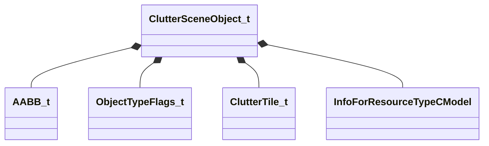

[Schemas](../../schemas.md) / [worldrenderer](../worldrenderer.md) / ClutterSceneObject_t

# ClutterSceneObject_t

> Source: **Build 25000182** · 2026-08-28 · `windows-x86_64` · schema `0.10.0`

**Kind:** class · **Size:** 176 bytes (`0xb0`) · **Align:** 8 · **Module:** worldrenderer

**Relationships:**

## Memory layout

11 fields (11 declared here, 0 inherited). Offsets are absolute from the object base.

| Offset | Field | Type | From | Annotations |
|--------|-------|------|------|-------------|
| `0x0` | `m_Bounds` | [AABB_t](../mathlib_extended/AABB_t.md) |  |  |
| `0x18` | `m_flags` | [ObjectTypeFlags_t](../worldrenderer/ObjectTypeFlags_t.md) |  |  |
| `0x1c` | `m_nLayer` | int16 |  |  |
| `0x20` | `m_instancePositions` | CUtlVector< Vector > |  |  |
| `0x50` | `m_instanceScales` | CUtlVector< float32 > |  |  |
| `0x68` | `m_instanceTintSrgb` | CUtlVector< Color > |  |  |
| `0x80` | `m_tiles` | CUtlVector< [ClutterTile_t](../worldrenderer/ClutterTile_t.md) > |  |  |
| `0x98` | `m_renderableModel` | CStrongHandle< [InfoForResourceTypeCModel](../resourcesystem/InfoForResourceTypeCModel.md) > |  |  |
| `0xa0` | `m_materialGroup` | CUtlStringToken |  |  |
| `0xa4` | `m_flBeginCullSize` | float32 |  |  |
| `0xa8` | `m_flEndCullSize` | float32 |  |  |

KV3 class defaults

<pre>{
	&quot;m_Bounds&quot;:
	{
		&quot;m_vMinBounds&quot;:
		[
			0.000000,
			0.000000,
			0.000000
		],
		&quot;m_vMaxBounds&quot;:
		[
			0.000000,
			0.000000,
			0.000000
		]
	},
	&quot;m_flags&quot;: &quot;OBJECT_TYPE_NONE&quot;,
	&quot;m_nLayer&quot;: 0,
	&quot;m_instancePositions&quot;:
	[
	],
	&quot;m_instanceScales&quot;:
	[
	],
	&quot;m_instanceTintSrgb&quot;:
	[
	],
	&quot;m_tiles&quot;:
	[
	],
	&quot;m_renderableModel&quot;: &quot;&quot;,
	&quot;m_materialGroup&quot;: &quot;&quot;,
	&quot;m_flBeginCullSize&quot;: 0.020000,
	&quot;m_flEndCullSize&quot;: 0.012500,
	&quot;m_InstanceOrientations32&quot;:
	[
	]
}</pre>

