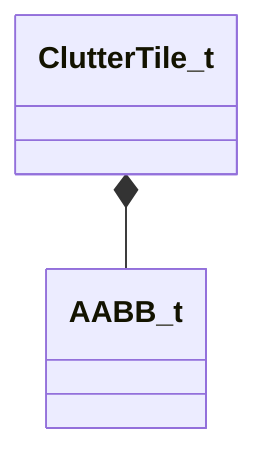

[Schemas](../../schemas.md) / [worldrenderer](../worldrenderer.md) / ClutterTile_t

# ClutterTile_t

> Source: **Build 25000182** · 2026-08-28 · `windows-x86_64` · schema `0.10.0`

**Kind:** class · **Size:** 32 bytes (`0x20`) · **Align:** 4 · **Module:** worldrenderer

**Relationships:**

## Memory layout

3 fields (3 declared here, 0 inherited). Offsets are absolute from the object base.

| Offset | Field | Type | From | Annotations |
|--------|-------|------|------|-------------|
| `0x0` | `m_nFirstInstance` | uint32 |  |  |
| `0x4` | `m_nLastInstance` | uint32 |  |  |
| `0x8` | `m_BoundsWs` | [AABB_t](../mathlib_extended/AABB_t.md) |  |  |

KV3 class defaults

<pre>{
	&quot;m_nFirstInstance&quot;: 0,
	&quot;m_nLastInstance&quot;: 0,
	&quot;m_BoundsWs&quot;:
	{
		&quot;m_vMinBounds&quot;:
		[
			0.000000,
			0.000000,
			0.000000
		],
		&quot;m_vMaxBounds&quot;:
		[
			0.000000,
			0.000000,
			0.000000
		]
	}
}</pre>

