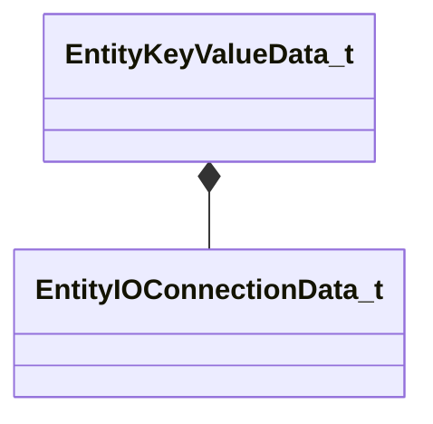

[Schemas](../../schemas.md) / [worldrenderer](../worldrenderer.md) / EntityKeyValueData_t

# EntityKeyValueData_t

> Source: **Build 25000182** · 2026-08-28 · `windows-x86_64` · schema `0.10.0`

**Kind:** class · **Size:** 56 bytes (`0x38`) · **Align:** 8 · **Module:** worldrenderer

**Relationships:**

## Memory layout

2 fields (2 declared here, 0 inherited). Offsets are absolute from the object base.

| Offset | Field | Type | From | Annotations |
|--------|-------|------|------|-------------|
| `0x8` | `m_connections` | CUtlVector< [EntityIOConnectionData_t](../worldrenderer/EntityIOConnectionData_t.md) > |  |  |
| `0x20` | `m_keyValuesData` | CUtlBinaryBlock |  |  |

KV3 class defaults

<pre>{
	&quot;m_connections&quot;:
	[
	],
	&quot;m_keyValuesData&quot;: &quot;[BINARY BLOB]&quot;
}</pre>

