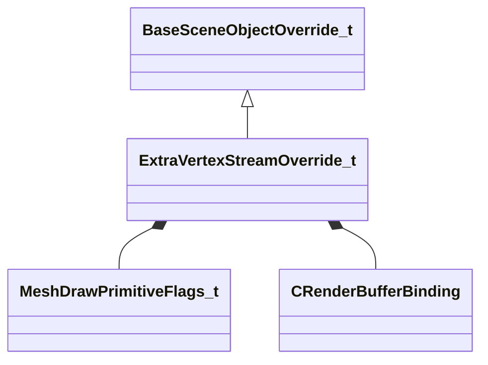

[Schemas](../../schemas.md) / [worldrenderer](../worldrenderer.md) / ExtraVertexStreamOverride_t

# ExtraVertexStreamOverride_t

> Source: **Build 25000182** · 2026-08-28 · `windows-x86_64` · schema `0.10.0`

**Kind:** class · **Size:** 48 bytes (`0x30`) · **Align:** 8 · **Module:** worldrenderer

**Inherits from:** [BaseSceneObjectOverride_t](../worldrenderer/BaseSceneObjectOverride_t.md)

**Relationships:**

## Memory layout

5 fields (4 declared here, 1 inherited). Offsets are absolute from the object base.

| Offset | Field | Type | From | Annotations |
|--------|-------|------|------|-------------|
| `0x0` | `m_nSceneObjectIndex` | uint32 | [BaseSceneObjectOverride_t](../worldrenderer/BaseSceneObjectOverride_t.md) |  |
| `0x4` | `m_nSubSceneObject` | uint32 |  |  |
| `0x8` | `m_nDrawCallIndex` | uint32 |  |  |
| `0xc` | `m_nAdditionalMeshDrawPrimitiveFlags` | [MeshDrawPrimitiveFlags_t](../modellib/MeshDrawPrimitiveFlags_t.md) |  |  |
| `0x10` | `m_extraBufferBinding` | [CRenderBufferBinding](../modellib/CRenderBufferBinding.md) |  |  |

KV3 class defaults

<pre>{
	&quot;m_nSceneObjectIndex&quot;: 0,
	&quot;m_nSubSceneObject&quot;: 0,
	&quot;m_nDrawCallIndex&quot;: 0,
	&quot;m_nAdditionalMeshDrawPrimitiveFlags&quot;: &quot;MESH_DRAW_FLAGS_NONE&quot;,
	&quot;m_extraBufferBinding&quot;:
	{
		&quot;m_hBuffer&quot;: 0,
		&quot;m_nBindOffsetBytes&quot;: 0
	}
}</pre>

