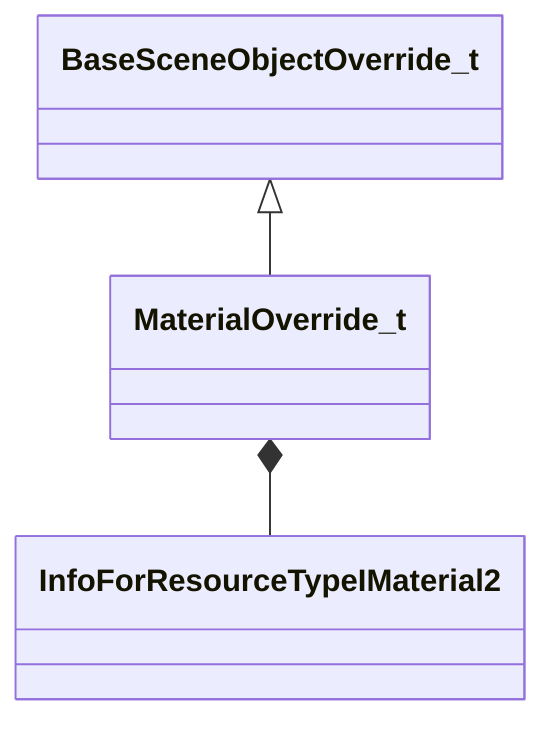

[Schemas](../../schemas.md) / [worldrenderer](../worldrenderer.md) / MaterialOverride_t

# MaterialOverride_t

> Source: **Build 25000182** · 2026-08-28 · `windows-x86_64` · schema `0.10.0`

**Kind:** class · **Size:** 40 bytes (`0x28`) · **Align:** 8 · **Module:** worldrenderer

**Inherits from:** [BaseSceneObjectOverride_t](../worldrenderer/BaseSceneObjectOverride_t.md)

**Relationships:**

## Memory layout

5 fields (4 declared here, 1 inherited). Offsets are absolute from the object base.

| Offset | Field | Type | From | Annotations |
|--------|-------|------|------|-------------|
| `0x0` | `m_nSceneObjectIndex` | uint32 | [BaseSceneObjectOverride_t](../worldrenderer/BaseSceneObjectOverride_t.md) |  |
| `0x4` | `m_nSubSceneObject` | uint32 |  |  |
| `0x8` | `m_nDrawCallIndex` | uint32 |  |  |
| `0x10` | `m_pMaterial` | CStrongHandle< [InfoForResourceTypeIMaterial2](../resourcesystem/InfoForResourceTypeIMaterial2.md) > |  |  |
| `0x18` | `m_vLinearTintColor` | Vector |  |  |

KV3 class defaults

<pre>{
	&quot;m_nSceneObjectIndex&quot;: 0,
	&quot;m_nSubSceneObject&quot;: 0,
	&quot;m_nDrawCallIndex&quot;: 0,
	&quot;m_pMaterial&quot;: &quot;&quot;,
	&quot;m_vLinearTintColor&quot;:
	[
		1.000000,
		1.000000,
		1.000000
	]
}</pre>

