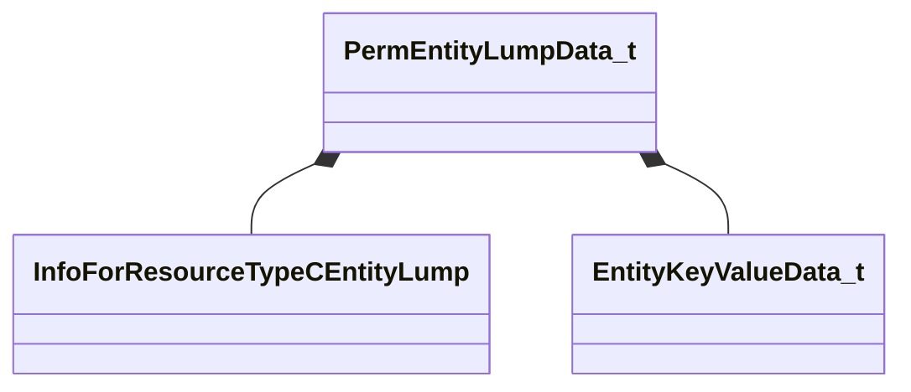

[Schemas](../../schemas.md) / [worldrenderer](../worldrenderer.md) / PermEntityLumpData_t

# PermEntityLumpData_t

> Source: **Build 25000182** · 2026-08-28 · `windows-x86_64` · schema `0.10.0`

**Kind:** class · **Size:** 56 bytes (`0x38`) · **Align:** 8 · **Module:** worldrenderer

**Relationships:**

## Memory layout

3 fields (3 declared here, 0 inherited). Offsets are absolute from the object base.

| Offset | Field | Type | From | Annotations |
|--------|-------|------|------|-------------|
| `0x8` | `m_name` | CUtlString |  |  |
| `0x10` | `m_childLumps` | CUtlVector< CStrongHandleCopyable< [InfoForResourceTypeCEntityLump](../resourcesystem/InfoForResourceTypeCEntityLump.md) > > |  |  |
| `0x28` | `m_entityKeyValues` | CUtlLeanVector< [EntityKeyValueData_t](../worldrenderer/EntityKeyValueData_t.md) > |  |  |

KV3 class defaults

<pre>{
	&quot;m_name&quot;: &quot;&quot;,
	&quot;m_childLumps&quot;:
	[
	],
	&quot;m_entityKeyValues&quot;:
	[
	]
}</pre>

