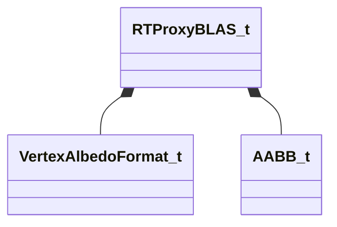

[Schemas](../../schemas.md) / [worldrenderer](../worldrenderer.md) / RTProxyBLAS_t

# RTProxyBLAS_t

> Source: **Build 25000182** · 2026-08-28 · `windows-x86_64` · schema `0.10.0`

**Kind:** class · **Size:** 68 bytes (`0x44`) · **Align:** 4 · **Module:** worldrenderer

**Relationships:**

## Memory layout

9 fields (9 declared here, 0 inherited). Offsets are absolute from the object base.

| Offset | Field | Type | From | Annotations |
|--------|-------|------|------|-------------|
| `0x0` | `m_nFirstIndex` | uint32 |  |  |
| `0x4` | `m_nIndexCount` | uint32 |  |  |
| `0x8` | `m_nVBByteOffset` | uint32 |  |  |
| `0xc` | `m_nBaseVertex` | uint32 |  |  |
| `0x10` | `m_nVertexCount` | uint16 |  |  |
| `0x12` | `m_albedoFormat` | [VertexAlbedoFormat_t](../modellib/VertexAlbedoFormat_t.md) |  |  |
| `0x14` | `m_boundLs` | [AABB_t](../mathlib_extended/AABB_t.md) |  |  |
| `0x2c` | `m_vVertexOriginLs` | Vector |  |  |
| `0x38` | `m_vVertexExtentLs` | Vector |  |  |
