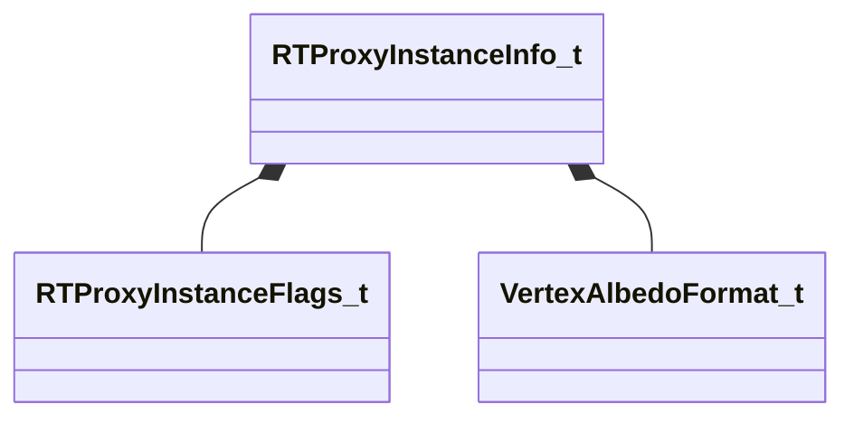

[Schemas](../../schemas.md) / [worldrenderer](../worldrenderer.md) / RTProxyInstanceInfo_t

# RTProxyInstanceInfo_t

> Source: **Build 25000182** · 2026-08-28 · `windows-x86_64` · schema `0.10.0`

**Kind:** class · **Size:** 72 bytes (`0x48`) · **Align:** 4 · **Module:** worldrenderer

**Relationships:**

## Memory layout

9 fields (9 declared here, 0 inherited). Offsets are absolute from the object base.

| Offset | Field | Type | From | Annotations |
|--------|-------|------|------|-------------|
| `0x0` | `m_nFlags` | [RTProxyInstanceFlags_t](../worldrenderer/RTProxyInstanceFlags_t.md) |  |  |
| `0x1` | `m_albedoFormat` | [VertexAlbedoFormat_t](../modellib/VertexAlbedoFormat_t.md) |  |  |
| `0x2` | `m_emissiveFormat` | [VertexAlbedoFormat_t](../modellib/VertexAlbedoFormat_t.md) |  |  |
| `0x4` | `m_nBLASCount` | uint16 |  |  |
| `0x8` | `m_nBLASIndex` | uint32 |  |  |
| `0xc` | `m_nVertexAlbedoByteOffset` | uint32 |  |  |
| `0x10` | `m_nVertexEmissiveByteOffset` | uint32 |  |  |
| `0x14` | `m_fEmissiveFactor` | float32 |  |  |
| `0x18` | `m_mWorldFromLocal` | matrix3x4_t |  |  |

KV3 class defaults

<pre>{
	&quot;m_nFlags&quot;: &quot;&quot;,
	&quot;m_albedoFormat&quot;: &quot;VERTEX_ALBEDO_NONE&quot;,
	&quot;m_emissiveFormat&quot;: &quot;VERTEX_ALBEDO_NONE&quot;,
	&quot;m_nBLASCount&quot;: 0,
	&quot;m_nBLASIndex&quot;: 0,
	&quot;m_nVertexAlbedoByteOffset&quot;: 0,
	&quot;m_nVertexEmissiveByteOffset&quot;: 0,
	&quot;m_fEmissiveFactor&quot;: 0.000000,
	&quot;m_mWorldFromLocal&quot;:
	[
		0.000000,
		0.000000,
		0.000000,
		0.000000,
		0.000000,
		0.000000,
		0.000000,
		0.000000,
		0.000000,
		0.000000,
		0.000000,
		0.000000
	]
}</pre>

