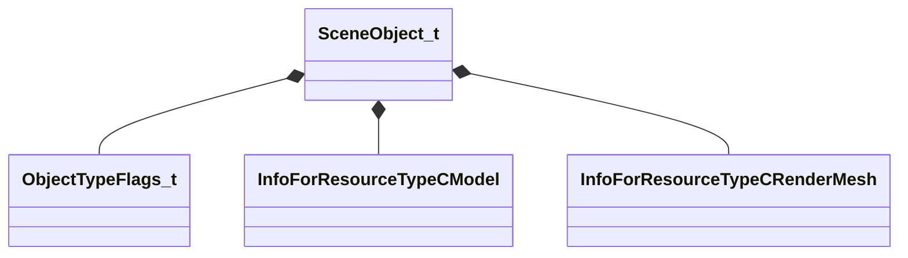

[Schemas](../../schemas.md) / [worldrenderer](../worldrenderer.md) / SceneObject_t

# SceneObject_t

> Source: **Build 25000182** · 2026-08-28 · `windows-x86_64` · schema `0.10.0`

**Kind:** class · **Size:** 136 bytes (`0x88`) · **Align:** 8 · **Module:** worldrenderer

**Relationships:**

## Memory layout

14 fields (14 declared here, 0 inherited). Offsets are absolute from the object base.

| Offset | Field | Type | From | Annotations |
|--------|-------|------|------|-------------|
| `0x0` | `m_nObjectID` | uint32 |  |  |
| `0x4` | `m_vTransform` | Vector4D[3] |  |  |
| `0x34` | `m_flFadeStartDistance` | float32 |  |  |
| `0x38` | `m_flFadeEndDistance` | float32 |  |  |
| `0x3c` | `m_vTintColor` | Vector4D |  |  |
| `0x50` | `m_skin` | CUtlString |  |  |
| `0x58` | `m_nObjectTypeFlags` | [ObjectTypeFlags_t](../worldrenderer/ObjectTypeFlags_t.md) |  |  |
| `0x5c` | `m_vLightingOrigin` | Vector |  |  |
| `0x68` | `m_nOverlayRenderOrder` | int16 |  |  |
| `0x6a` | `m_nLODOverride` | int16 |  |  |
| `0x6c` | `m_nCubeMapPrecomputedHandshake` | int32 |  |  |
| `0x70` | `m_nLightProbeVolumePrecomputedHandshake` | int32 |  |  |
| `0x78` | `m_renderableModel` | CStrongHandle< [InfoForResourceTypeCModel](../resourcesystem/InfoForResourceTypeCModel.md) > |  |  |
| `0x80` | `m_renderable` | CStrongHandle< [InfoForResourceTypeCRenderMesh](../resourcesystem/InfoForResourceTypeCRenderMesh.md) > |  |  |

KV3 class defaults

<pre>{
	&quot;m_nObjectID&quot;: 0,
	&quot;m_vTransform&quot;:
	[
		[
			0.000000,
			0.000000,
			0.000000,
			0.000000
		],
		[
			0.000000,
			0.000000,
			0.000000,
			0.000000
		],
		[
			0.000000,
			0.000000,
			0.000000,
			0.000000
		]
	],
	&quot;m_flFadeStartDistance&quot;: 0.000000,
	&quot;m_flFadeEndDistance&quot;: 0.000000,
	&quot;m_vTintColor&quot;:
	[
		1.000000,
		1.000000,
		1.000000,
		1.000000
	],
	&quot;m_skin&quot;: &quot;&quot;,
	&quot;m_nObjectTypeFlags&quot;: &quot;OBJECT_TYPE_MODEL&quot;,
	&quot;m_vLightingOrigin&quot;:
	[
		340282346638528859811704183484516925440.000000,
		340282346638528859811704183484516925440.000000,
		340282346638528859811704183484516925440.000000
	],
	&quot;m_nOverlayRenderOrder&quot;: 0,
	&quot;m_nLODOverride&quot;: -1,
	&quot;m_nCubeMapPrecomputedHandshake&quot;: 0,
	&quot;m_nLightProbeVolumePrecomputedHandshake&quot;: 0,
	&quot;m_renderableModel&quot;: &quot;&quot;,
	&quot;m_renderable&quot;: &quot;&quot;
}</pre>

