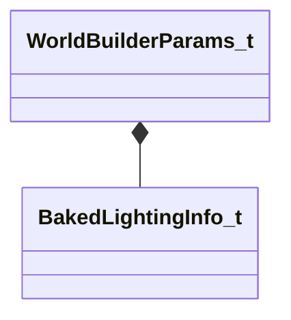

[Schemas](../../schemas.md) / [worldrenderer](../worldrenderer.md) / WorldBuilderParams_t

# WorldBuilderParams_t

> Source: **Build 25000182** · 2026-08-28 · `windows-x86_64` · schema `0.10.0`

**Kind:** class · **Size:** 96 bytes (`0x60`) · **Align:** 8 · **Module:** worldrenderer

**Relationships:**

## Memory layout

6 fields (6 declared here, 0 inherited). Offsets are absolute from the object base.

| Offset | Field | Type | From | Annotations |
|--------|-------|------|------|-------------|
| `0x0` | `m_flMinDrawVolumeSize` | float32 |  |  |
| `0x4` | `m_bBuildBakedLighting` | bool |  |  |
| `0x5` | `m_bAggregateInstanceStreams` | bool |  |  |
| `0x8` | `m_bakedLightingInfo` | [BakedLightingInfo_t](../worldrenderer/BakedLightingInfo_t.md) |  |  |
| `0x50` | `m_nCompileTimestamp` | uint64 |  |  |
| `0x58` | `m_nCompileFingerprint` | uint64 |  |  |

KV3 class defaults

<pre>{
	&quot;m_flMinDrawVolumeSize&quot;: 0.000000,
	&quot;m_bBuildBakedLighting&quot;: false,
	&quot;m_bAggregateInstanceStreams&quot;: false,
	&quot;m_bakedLightingInfo&quot;:
	{
		&quot;m_nLightmapVersionNumber&quot;: 0,
		&quot;m_nLightmapGameVersionNumber&quot;: 0,
		&quot;m_vLightmapUvScale&quot;:
		[
			1.000000,
			1.000000
		],
		&quot;m_bHasLightmaps&quot;: false,
		&quot;m_bBakedShadowsGamma20&quot;: false,
		&quot;m_bCompressionEnabled&quot;: false,
		&quot;m_bSHLightmaps&quot;: false,
		&quot;m_nChartPackIterations&quot;: 0,
		&quot;m_nVradQuality&quot;: 0,
		&quot;m_lightMaps&quot;:
		[
		],
		&quot;m_bakedShadows&quot;:
		[
		]
	},
	&quot;m_nCompileTimestamp&quot;: 0,
	&quot;m_nCompileFingerprint&quot;: 0
}</pre>

