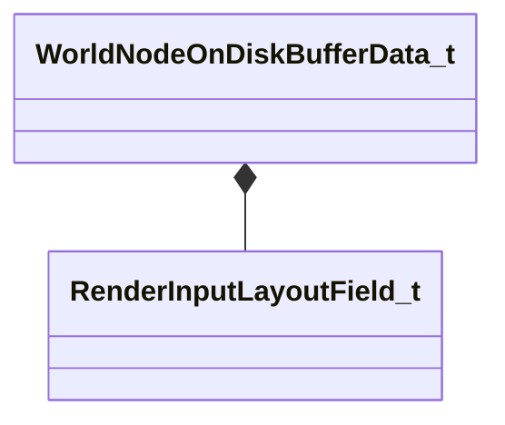

[Schemas](../../schemas.md) / [worldrenderer](../worldrenderer.md) / WorldNodeOnDiskBufferData_t

# WorldNodeOnDiskBufferData_t

> Source: **Build 25000182** · 2026-08-28 · `windows-x86_64` · schema `0.10.0`

**Kind:** class · **Size:** 56 bytes (`0x38`) · **Align:** 8 · **Module:** worldrenderer

**Relationships:**

## Memory layout

4 fields (4 declared here, 0 inherited). Offsets are absolute from the object base.

| Offset | Field | Type | From | Annotations |
|--------|-------|------|------|-------------|
| `0x0` | `m_nElementCount` | int32 |  |  |
| `0x4` | `m_nElementSizeInBytes` | int32 |  |  |
| `0x8` | `m_inputLayoutFields` | CUtlVector< [RenderInputLayoutField_t](../modellib/RenderInputLayoutField_t.md) > |  |  |
| `0x20` | `m_pData` | CUtlVector< uint8 > |  |  |

KV3 class defaults

<pre>{
	&quot;m_nElementCount&quot;: 0,
	&quot;m_nElementSizeInBytes&quot;: 0,
	&quot;m_inputLayoutFields&quot;:
	[
	],
	&quot;m_pData&quot;:
	[
	]
}</pre>

