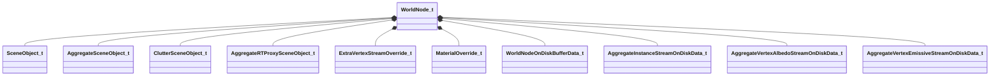

[Schemas](../../schemas.md) / [worldrenderer](../worldrenderer.md) / WorldNode_t

# WorldNode_t

**Kind:** class · **Size:** 400 bytes (`0x190`) · **Align:** 8 · **Module:** worldrenderer

**Relationships:**

## Memory layout

16 fields (16 declared here, 0 inherited). Offsets are absolute from the object base.

| Offset | Field | Type | From | Annotations |
|--------|-------|------|------|-------------|
| `0x0` | `m_sceneObjects` | CUtlVector< [SceneObject_t](../worldrenderer/SceneObject_t.md) > |  |  |
| `0x18` | `m_visClusterMembership` | CUtlVector< uint16 > |  |  |
| `0x30` | `m_aggregateSceneObjects` | CUtlVector< [AggregateSceneObject_t](../worldrenderer/AggregateSceneObject_t.md) > |  |  |
| `0x48` | `m_clutterSceneObjects` | CUtlVector< [ClutterSceneObject_t](../worldrenderer/ClutterSceneObject_t.md) > |  |  |
| `0x60` | `m_rtProxies` | CUtlVector< [AggregateRTProxySceneObject_t](../worldrenderer/AggregateRTProxySceneObject_t.md) > |  |  |
| `0x78` | `m_extraVertexStreamOverrides` | CUtlVector< [ExtraVertexStreamOverride_t](../worldrenderer/ExtraVertexStreamOverride_t.md) > |  |  |
| `0x90` | `m_materialOverrides` | CUtlVector< [MaterialOverride_t](../worldrenderer/MaterialOverride_t.md) > |  |  |
| `0xa8` | `m_extraVertexStreams` | CUtlVector< [WorldNodeOnDiskBufferData_t](../worldrenderer/WorldNodeOnDiskBufferData_t.md) > |  |  |
| `0xc0` | `m_aggregateInstanceStreams` | CUtlVector< [AggregateInstanceStreamOnDiskData_t](../worldrenderer/AggregateInstanceStreamOnDiskData_t.md) > |  |  |
| `0xd8` | `m_vertexAlbedoStreams` | CUtlVector< [AggregateVertexAlbedoStreamOnDiskData_t](../worldrenderer/AggregateVertexAlbedoStreamOnDiskData_t.md) > |  |  |
| `0xf0` | `m_vertexEmissiveStreams` | CUtlVector< [AggregateVertexEmissiveStreamOnDiskData_t](../worldrenderer/AggregateVertexEmissiveStreamOnDiskData_t.md) > |  |  |
| `0x108` | `m_layerNames` | CUtlVector< CUtlString > |  |  |
| `0x120` | `m_sceneObjectLayerIndices` | CUtlVector< uint8 > |  |  |
| `0x138` | `m_grassFileName` | CUtlString |  |  |
| `0x140` | `m_nodeLightingInfo` | [BakedLightingInfo_t](../worldrenderer/BakedLightingInfo_t.md) |  |  |
| `0x188` | `m_bHasBakedGeometryFlag` | bool |  |  |

KV3 class defaults

<pre>{
	&quot;m_sceneObjects&quot;:
	[
	],
	&quot;m_visClusterMembership&quot;:
	[
	],
	&quot;m_aggregateSceneObjects&quot;:
	[
	],
	&quot;m_clutterSceneObjects&quot;:
	[
	],
	&quot;m_rtProxies&quot;:
	[
	],
	&quot;m_extraVertexStreamOverrides&quot;:
	[
	],
	&quot;m_materialOverrides&quot;:
	[
	],
	&quot;m_extraVertexStreams&quot;:
	[
	],
	&quot;m_aggregateInstanceStreams&quot;:
	[
	],
	&quot;m_vertexAlbedoStreams&quot;:
	[
	],
	&quot;m_vertexEmissiveStreams&quot;:
	[
	],
	&quot;m_layerNames&quot;:
	[
	],
	&quot;m_sceneObjectLayerIndices&quot;:
	[
	],
	&quot;m_grassFileName&quot;: &quot;&quot;,
	&quot;m_nodeLightingInfo&quot;:
	{
		&quot;m_nLightmapVersionNumber&quot;: 0,
		&quot;m_nLightmapGameVersionNumber&quot;: 0,
		&quot;m_vLightmapUvScale&quot;:
		[
			1.000000,
			1.000000
		],
		&quot;m_bHasLightmaps&quot;: false,
		&quot;m_bBakedShadowsGamma20&quot;: false,
		&quot;m_bCompressionEnabled&quot;: false,
		&quot;m_bSHLightmaps&quot;: false,
		&quot;m_nChartPackIterations&quot;: 0,
		&quot;m_nVradQuality&quot;: 0,
		&quot;m_lightMaps&quot;:
		[
		],
		&quot;m_bakedShadows&quot;:
		[
		]
	},
	&quot;m_bHasBakedGeometryFlag&quot;: false
}</pre>

