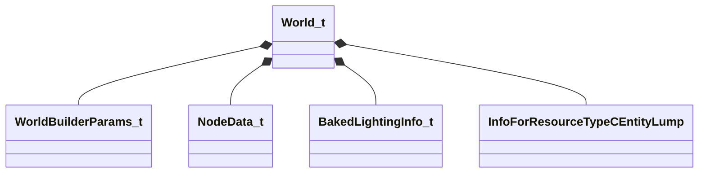

[Schemas](../../schemas.md) / [worldrenderer](../worldrenderer.md) / World_t

# World_t

**Kind:** class · **Size:** 216 bytes (`0xd8`) · **Align:** 8 · **Module:** worldrenderer

**Relationships:**

## Memory layout

4 fields (4 declared here, 0 inherited). Offsets are absolute from the object base.

| Offset | Field | Type | From | Annotations |
|--------|-------|------|------|-------------|
| `0x0` | `m_builderParams` | [WorldBuilderParams_t](../worldrenderer/WorldBuilderParams_t.md) |  |  |
| `0x60` | `m_worldNodes` | CUtlVector< [NodeData_t](../worldrenderer/NodeData_t.md) > |  |  |
| `0x78` | `m_worldLightingInfo` | [BakedLightingInfo_t](../worldrenderer/BakedLightingInfo_t.md) |  |  |
| `0xc0` | `m_entityLumps` | CUtlVector< CStrongHandleCopyable< [InfoForResourceTypeCEntityLump](../resourcesystem/InfoForResourceTypeCEntityLump.md) > > |  |  |

KV3 class defaults

<pre>{
	&quot;m_builderParams&quot;:
	{
		&quot;m_flMinDrawVolumeSize&quot;: 0.000000,
		&quot;m_bBuildBakedLighting&quot;: false,
		&quot;m_bAggregateInstanceStreams&quot;: false,
		&quot;m_bakedLightingInfo&quot;:
		{
			&quot;m_nLightmapVersionNumber&quot;: 0,
			&quot;m_nLightmapGameVersionNumber&quot;: 0,
			&quot;m_vLightmapUvScale&quot;:
			[
				1.000000,
				1.000000
			],
			&quot;m_bHasLightmaps&quot;: false,
			&quot;m_bBakedShadowsGamma20&quot;: false,
			&quot;m_bCompressionEnabled&quot;: false,
			&quot;m_bSHLightmaps&quot;: false,
			&quot;m_nChartPackIterations&quot;: 0,
			&quot;m_nVradQuality&quot;: 0,
			&quot;m_lightMaps&quot;:
			[
			],
			&quot;m_bakedShadows&quot;:
			[
			]
		},
		&quot;m_nCompileTimestamp&quot;: 0,
		&quot;m_nCompileFingerprint&quot;: 0
	},
	&quot;m_worldNodes&quot;:
	[
	],
	&quot;m_worldLightingInfo&quot;:
	{
		&quot;m_nLightmapVersionNumber&quot;: 0,
		&quot;m_nLightmapGameVersionNumber&quot;: 0,
		&quot;m_vLightmapUvScale&quot;:
		[
			1.000000,
			1.000000
		],
		&quot;m_bHasLightmaps&quot;: false,
		&quot;m_bBakedShadowsGamma20&quot;: false,
		&quot;m_bCompressionEnabled&quot;: false,
		&quot;m_bSHLightmaps&quot;: false,
		&quot;m_nChartPackIterations&quot;: 0,
		&quot;m_nVradQuality&quot;: 0,
		&quot;m_lightMaps&quot;:
		[
		],
		&quot;m_bakedShadows&quot;:
		[
		]
	},
	&quot;m_entityLumps&quot;:
	[
	]
}</pre>

