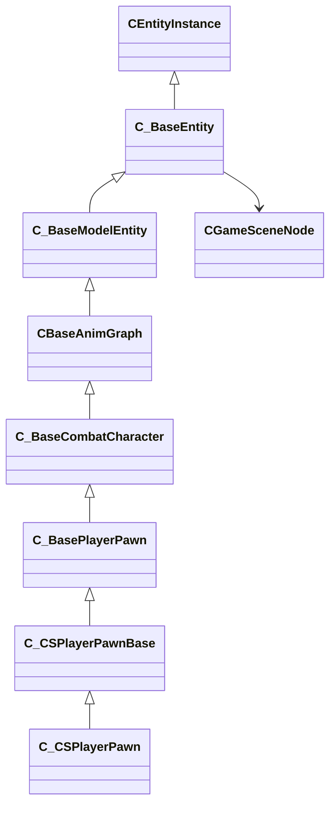

# UML: client

Class relationships (inheritance and composition) for the `client` module.

**Arrow legend:** `<|--` inheritance &nbsp; `*--` composition &nbsp; `-->` association/pointer

```mermaid
classDiagram
    C_BaseModelEntity <|-- CBaseAnimGraph
    CBaseAnimGraph <|-- C_BaseCombatCharacter
    CEntityInstance <|-- C_BaseEntity
    C_BaseEntity <|-- C_BaseModelEntity
    C_BaseCombatCharacter <|-- C_BasePlayerPawn
    C_CSPlayerPawnBase <|-- C_CSPlayerPawn
    C_BasePlayerPawn <|-- C_CSPlayerPawnBase
    C_BaseEntity --> CGameSceneNode
```
