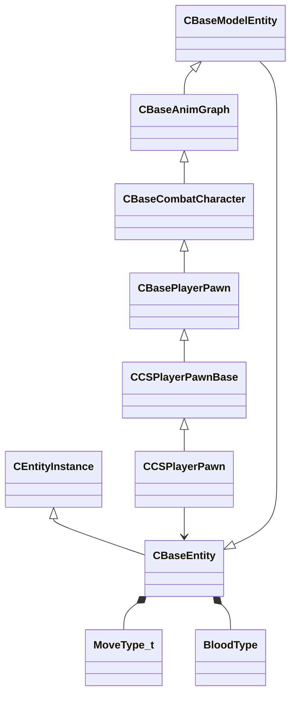

# UML: server

Class relationships (inheritance and composition) for the `server` module.

**Arrow legend:** `<|--` inheritance &nbsp; `*--` composition &nbsp; `-->` association/pointer

```mermaid
classDiagram
    CBaseModelEntity <|-- CBaseAnimGraph
    CBaseAnimGraph <|-- CBaseCombatCharacter
    CEntityInstance <|-- CBaseEntity
    CBaseEntity <|-- CBaseModelEntity
    CBaseCombatCharacter <|-- CBasePlayerPawn
    CCSPlayerPawnBase <|-- CCSPlayerPawn
    CBasePlayerPawn <|-- CCSPlayerPawnBase
    CBaseEntity *-- MoveType_t
    CBaseEntity *-- BloodType
    CCSPlayerPawn --> CBaseEntity
```
