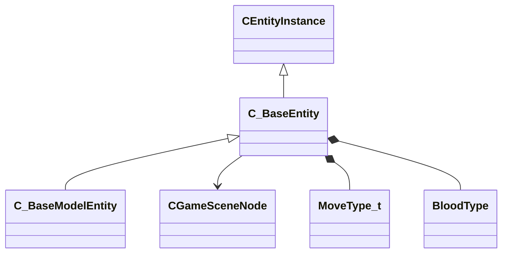

[Schemas](../../schemas.md) / [client](../client.md) / C_BaseEntity

# C_BaseEntity

> Source: **Build 9000001** · 2026-08-28 · `windows-x86_64` · schema `0.10.0`

**Kind:** class · **Size:** 1536 bytes (`0x600`) · **Align:** 8 · **Module:** client

**Inherits from:** [CEntityInstance](../entity2/CEntityInstance.md)

**Derived by:** [C_BaseModelEntity](../client/C_BaseModelEntity.md)

**Relationships:**

## Memory layout

85 fields (82 declared here, 3 inherited). Offsets are absolute from the object base.

| Offset | Field | Type | From | Annotations |
|--------|-------|------|------|-------------|
| `0x8` | `m_iszPrivateVScripts` | CUtlSymbolLarge | [CEntityInstance](../entity2/CEntityInstance.md) |  |
| `0x10` | `m_pEntity` | CEntityIdentity* | [CEntityInstance](../entity2/CEntityInstance.md) | CEntityIdentity pointer — the entity's identity record (name, class, handle, flags). |
| `0x28` | `m_CScriptComponent` | CScriptComponent* | [CEntityInstance](../entity2/CEntityInstance.md) | VScript component attached to the entity, when scripted. |
| `0x30` | `m_CBodyComponent` | CBodyComponent* |  |  |
| `0x38` | `m_NetworkTransmitComponent` | CNetworkTransmitComponent |  | `MNotSaved` |
| `0x328` | `m_nLastThinkTick` | GameTick_t |  | `MNotSaved` |
| `0x330` | `m_pGameSceneNode` | [CGameSceneNode](../client/CGameSceneNode.md)* |  | `MNotSaved` |
| `0x338` | `m_pRenderComponent` | CRenderComponent* |  | `MNotSaved` |
| `0x340` | `m_pCollision` | CCollisionProperty* |  | `MNotSaved` |
| `0x348` | `m_iMaxHealth` | int32 |  | `MNotSaved` |
| `0x34c` | `m_iHealth` | int32 |  |  |
| `0x350` | `m_flDamageAccumulator` | float32 |  | `MNotSaved` |
| `0x354` | `m_lifeState` | uint8 |  | `MNotSaved` |
| `0x355` | `m_bTakesDamage` | bool |  | `MNotSaved` |
| `0x358` | `m_nTakeDamageFlags` | TakeDamageFlags_t |  | `MNotSaved` |
| `0x360` | `m_nPlatformType` | EntityPlatformTypes_t |  |  |
| `0x361` | `m_ubInterpolationFrame` | uint8 |  | `MNotSaved` |
| `0x364` | `m_hSceneObjectController` | CHandle< [C_BaseEntity](../client/C_BaseEntity.md) > |  |  |
| `0x368` | `m_nNoInterpolationTick` | int32 |  | `MNotSaved` |
| `0x36c` | `m_nVisibilityNoInterpolationTick` | int32 |  | `MNotSaved` |
| `0x370` | `m_flProxyRandomValue` | float32 |  | `MNotSaved` |
| `0x374` | `m_iEFlags` | int32 |  | `MNotSaved` |
| `0x378` | `m_nWaterType` | uint8 |  | `MNotSaved` |
| `0x379` | `m_bInterpolateEvenWithNoModel` | bool |  | `MNotSaved` |
| `0x37a` | `m_bPredictionEligible` | bool |  | `MNotSaved` |
| `0x37b` | `m_bApplyLayerMatchIDToModel` | bool |  | `MNotSaved` |
| `0x37c` | `m_tokLayerMatchID` | CUtlStringToken |  | `MNotSaved` |
| `0x380` | `m_nSubclassID` | CUtlStringToken |  |  |
| `0x390` | `m_nSimulationTick` | int32 |  | `MNotSaved` |
| `0x394` | `m_iCurrentThinkContext` | int32 |  | `MNotSaved` |
| `0x398` | `m_aThinkFunctions` | CUtlVector< thinkfunc_t > |  | `MNotSaved` |
| `0x3b0` | `m_bDisabledContextThinks` | bool |  |  |
| `0x3b4` | `m_flAnimTime` | float32 |  | `MNotSaved` |
| `0x3b8` | `m_flSimulationTime` | float32 |  | `MNotSaved` |
| `0x3bc` | `m_nSceneObjectOverrideFlags` | uint8 |  |  |
| `0x3bd` | `m_bHasSuccessfullyInterpolated` | bool |  | `MNotSaved` |
| `0x3be` | `m_bHasAddedVarsToInterpolation` | bool |  | `MNotSaved` |
| `0x3bf` | `m_bRenderEvenWhenNotSuccessfullyInterpolated` | bool |  | `MNotSaved` |
| `0x3c0` | `m_nInterpolationLatchDirtyFlags` | int32[2] |  | `MNotSaved` |
| `0x3c8` | `m_ListEntry` | uint16[11] |  | `MNotSaved` |
| `0x3e0` | `m_flCreateTime` | GameTime_t |  | `MNotSaved` |
| `0x3e4` | `m_EntClientFlags` | uint16 |  | `MNotSaved` |
| `0x3e6` | `m_bClientSideRagdoll` | bool |  | `MNotSaved` |
| `0x3e7` | `m_iTeamNum` | uint8 |  | `MNotSaved` |
| `0x3e8` | `m_spawnflags` | uint32 |  |  |
| `0x3ec` | `m_nNextThinkTick` | GameTick_t |  | `MNotSaved` |
| `0x3f4` | `m_fFlags` | uint32 |  | `MSaveBehavior` |
| `0x3f8` | `m_vecAbsVelocity` | Vector |  | `MNotSaved` |
| `0x404` | `m_vecServerVelocity` | CNetworkVelocityVector |  | `MNotSaved` |
| `0x430` | `m_vecVelocity` | CNetworkVelocityVector |  |  |
| `0x510` | `m_vecBaseVelocity` | Vector |  | `MNotSaved` |
| `0x51c` | `m_hEffectEntity` | CHandle< [C_BaseEntity](../client/C_BaseEntity.md) > |  | `MNotSaved` |
| `0x520` | `m_hOwnerEntity` | CHandle< [C_BaseEntity](../client/C_BaseEntity.md) > |  |  |
| `0x524` | `m_MoveCollide` | MoveCollide_t |  | `MNotSaved` |
| `0x525` | `m_MoveType` | [MoveType_t](../server/MoveType_t.md) |  |  |
| `0x526` | `m_nActualMoveType` | [MoveType_t](../server/MoveType_t.md) |  |  |
| `0x528` | `m_flWaterLevel` | float32 |  | `MNotSaved` |
| `0x52c` | `m_fEffects` | uint32 |  | `MNotSaved` |
| `0x530` | `m_hGroundEntity` | CHandle< [C_BaseEntity](../client/C_BaseEntity.md) > |  | `MNotSaved` |
| `0x534` | `m_nGroundBodyIndex` | int32 |  | `MNotSaved` |
| `0x538` | `m_flFriction` | float32 |  | `MNotSaved` |
| `0x53c` | `m_flElasticity` | float32 |  | `MNotSaved` |
| `0x540` | `m_flGravityScale` | float32 |  | `MNotSaved` |
| `0x544` | `m_flTimeScale` | float32 |  | `MNotSaved` |
| `0x548` | `m_bAnimatedEveryTick` | bool |  | `MNotSaved` |
| `0x549` | `m_bGravityDisabled` | bool |  |  |
| `0x54c` | `m_flNavIgnoreUntilTime` | GameTime_t |  | `MNotSaved` |
| `0x550` | `m_hThink` | uint16 |  | `MNotSaved` |
| `0x560` | `m_fBBoxVisFlags` | uint8 |  | `MNotSaved` |
| `0x564` | `m_flActualGravityScale` | float32 |  |  |
| `0x568` | `m_bGravityActuallyDisabled` | bool |  |  |
| `0x569` | `m_bPredictable` | bool |  | `MNotSaved` |
| `0x56a` | `m_bRenderWithViewModels` | bool |  |  |
| `0x56c` | `m_nFirstPredictableCommand` | int32 |  | `MNotSaved` |
| `0x570` | `m_nLastPredictableCommand` | int32 |  | `MNotSaved` |
| `0x574` | `m_hOldMoveParent` | CHandle< [C_BaseEntity](../client/C_BaseEntity.md) > |  | `MNotSaved` |
| `0x578` | `m_Particles` | CParticleProperty |  | `MNotSaved` |
| `0x5a8` | `m_vecAngVelocity` | QAngle |  |  |
| `0x5b4` | `m_DataChangeEventRef` | int32 |  | `MNotSaved` |
| `0x5b8` | `m_dependencies` | CUtlVector< CEntityHandle > |  | `MNotSaved` |
| `0x5d0` | `m_nCreationTick` | int32 |  | `MNotSaved` |
| `0x5e1` | `m_bAnimTimeChanged` | bool |  | `MNotSaved` |
| `0x5e2` | `m_bSimulationTimeChanged` | bool |  | `MNotSaved` |
| `0x5f0` | `m_sUniqueHammerID` | CUtlString |  | `MNotSaved` |
| `0x5f8` | `m_nBloodType` | [BloodType](../server/BloodType.md) |  |  |
