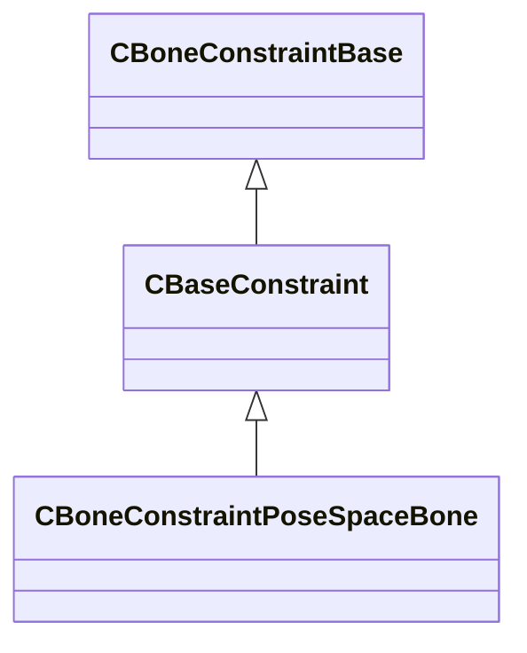

[Schemas](../../schemas.md) / [modellib](../modellib.md) / CBaseConstraint

# CBaseConstraint

> Source: **Build 9000001** · 2026-08-28 · `windows-x86_64` · schema `0.10.0`

**Kind:** class · **Size:** 96 bytes (`0x60`) · **Align:** n/a (unspecified) · **Module:** modellib

**Inherits from:** [CBoneConstraintBase](../modellib/CBoneConstraintBase.md)

**Derived by:** [CBoneConstraintPoseSpaceBone](../modellib/CBoneConstraintPoseSpaceBone.md)

**Relationships:**

## Memory layout

4 fields (4 declared here, 0 inherited). Offsets are absolute from the object base.

| Offset | Field | Type | From | Annotations |
|--------|-------|------|------|-------------|
| `0x20` | `m_name` | CUtlString |  |  |
| `0x28` | `m_vUpVector` | Vector |  |  |
| `0x38` | `m_slaves` | CUtlLeanVector< CConstraintSlave > |  |  |
| `0x48` | `m_targets` | CUtlVector< CConstraintTarget > |  |  |
