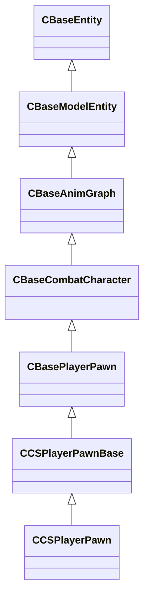

[Schemas](../../schemas.md) / [server](../server.md) / CCSPlayerPawnBase

# CCSPlayerPawnBase

> Source: **Build 9000001** · 2026-08-28 · `windows-x86_64` · schema `0.10.0`

Abstract base class shared by CCSPlayerPawn and CCSObserverPawn, providing the flash-bang state, progress bar, and original-controller link.

**Kind:** class · **Size:** 3376 bytes (`0xd30`) · **Align:** 16 · **Module:** server

**Inherits from:** [CBasePlayerPawn](../server/CBasePlayerPawn.md)

**Derived by:** [CCSPlayerPawn](../server/CCSPlayerPawn.md)

**Relationships:**

## Memory layout

193 fields (15 declared here, 178 inherited). Offsets are absolute from the object base.

| Offset | Field | Type | From | Annotations |
|--------|-------|------|------|-------------|
| `0x8` | `m_iszPrivateVScripts` | CUtlSymbolLarge | [CEntityInstance](../entity2/CEntityInstance.md) |  |
| `0x10` | `m_pEntity` | CEntityIdentity* | [CEntityInstance](../entity2/CEntityInstance.md) | CEntityIdentity pointer: the entity's identity record (name, class, handle, flags). |
| `0x28` | `m_CScriptComponent` | CScriptComponent* | [CEntityInstance](../entity2/CEntityInstance.md) | VScript component attached to the entity, when scripted. |
| `0x30` | `m_CBodyComponent` | CBodyComponent* | [CBaseEntity](../server/CBaseEntity.md) |  |
| `0x38` | `m_NetworkTransmitComponent` | CNetworkTransmitComponent | [CBaseEntity](../server/CBaseEntity.md) |  |
| `0x248` | `m_aThinkFunctions` | CUtlVector< thinkfunc_t > | [CBaseEntity](../server/CBaseEntity.md) |  |
| `0x260` | `m_iCurrentThinkContext` | int32 | [CBaseEntity](../server/CBaseEntity.md) | `MNotSaved` |
| `0x264` | `m_nLastThinkTick` | GameTick_t | [CBaseEntity](../server/CBaseEntity.md) |  |
| `0x268` | `m_bDisabledContextThinks` | bool | [CBaseEntity](../server/CBaseEntity.md) |  |
| `0x278` | `m_isSteadyState` | CTypedBitVec< 64 > | [CBaseEntity](../server/CBaseEntity.md) | `MNotSaved` |
| `0x280` | `m_lastNetworkChange` | float32 | [CBaseEntity](../server/CBaseEntity.md) | `MNotSaved` |
| `0x288` | `m_think` | BASEPTR | [CBaseEntity](../server/CBaseEntity.md) |  |
| `0x290` | `m_ResponseContexts` | CUtlVector< ResponseContext_t > | [CBaseEntity](../server/CBaseEntity.md) |  |
| `0x2a8` | `m_iszResponseContext` | CUtlSymbolLarge | [CBaseEntity](../server/CBaseEntity.md) |  |
| `0x2b0` | `m_pfnTouch` | ENTITYFUNCPTR | [CBaseEntity](../server/CBaseEntity.md) |  |
| `0x2b8` | `m_pfnUse` | USEPTR | [CBaseEntity](../server/CBaseEntity.md) |  |
| `0x2c0` | `m_pfnBlocked` | ENTITYFUNCPTR | [CBaseEntity](../server/CBaseEntity.md) |  |
| `0x2c8` | `m_pfnMoveDone` | BASEPTR | [CBaseEntity](../server/CBaseEntity.md) |  |
| `0x2d0` | `m_iHealth` | int32 | [CBaseEntity](../server/CBaseEntity.md) | Current health points of the entity. Serialised with the 'ClampHealth' encoder so values above max are clamped. *Sent only to the Player network group and LocalPlayerExclusive.* |
| `0x2d4` | `m_iMaxHealth` | int32 | [CBaseEntity](../server/CBaseEntity.md) | Maximum health points; used to normalise health bars in the HUD. |
| `0x2d8` | `m_lifeState` | uint8 | [CBaseEntity](../server/CBaseEntity.md) | LIFE_STATE enum: 0 = Alive, 1 = Dying, 2 = Dead, 3 = Respawnable, 4 = Discardbody. |
| `0x2dc` | `m_flDamageAccumulator` | float32 | [CBaseEntity](../server/CBaseEntity.md) |  |
| `0x2e0` | `m_bTakesDamage` | bool | [CBaseEntity](../server/CBaseEntity.md) |  |
| `0x2e8` | `m_nTakeDamageFlags` | TakeDamageFlags_t | [CBaseEntity](../server/CBaseEntity.md) |  |
| `0x2f0` | `m_nPlatformType` | EntityPlatformTypes_t | [CBaseEntity](../server/CBaseEntity.md) |  |
| `0x2f2` | `m_MoveCollide` | MoveCollide_t | [CBaseEntity](../server/CBaseEntity.md) |  |
| `0x2f3` | `m_MoveType` | [MoveType_t](../server/MoveType_t.md) | [CBaseEntity](../server/CBaseEntity.md) |  |
| `0x2f4` | `m_nPreviouslySetMoveType` | [MoveType_t](../server/MoveType_t.md) | [CBaseEntity](../server/CBaseEntity.md) |  |
| `0x2f5` | `m_nActualMoveType` | [MoveType_t](../server/MoveType_t.md) | [CBaseEntity](../server/CBaseEntity.md) |  |
| `0x2f6` | `m_nWaterTouch` | uint8 | [CBaseEntity](../server/CBaseEntity.md) | `MNotSaved` |
| `0x2f7` | `m_nSlimeTouch` | uint8 | [CBaseEntity](../server/CBaseEntity.md) | `MNotSaved` |
| `0x2f8` | `m_bRestoreInHierarchy` | bool | [CBaseEntity](../server/CBaseEntity.md) |  |
| `0x300` | `m_target` | CUtlSymbolLarge | [CBaseEntity](../server/CBaseEntity.md) |  |
| `0x308` | `m_hDamageFilter` | CHandle< CBaseFilter > | [CBaseEntity](../server/CBaseEntity.md) |  |
| `0x310` | `m_iszDamageFilterName` | CUtlSymbolLarge | [CBaseEntity](../server/CBaseEntity.md) |  |
| `0x318` | `m_flMoveDoneTime` | float32 | [CBaseEntity](../server/CBaseEntity.md) |  |
| `0x31c` | `m_nSubclassID` | CUtlStringToken | [CBaseEntity](../server/CBaseEntity.md) |  |
| `0x328` | `m_flAnimTime` | float32 | [CBaseEntity](../server/CBaseEntity.md) | Floating-point timestamp of the most-recent animation update; used by the client for animation interpolation. `MKV3TransferSaveOpsForField GetEngineTimeSaveRestoreOps` |
| `0x32c` | `m_flSimulationTime` | float32 | [CBaseEntity](../server/CBaseEntity.md) | Floating-point timestamp of the most-recent physics simulation step; used by the client for position interpolation. `MKV3TransferSaveOpsForField GetEngineTimeSaveRestoreOps` |
| `0x330` | `m_flCreateTime` | GameTime_t | [CBaseEntity](../server/CBaseEntity.md) |  |
| `0x334` | `m_bClientSideRagdoll` | bool | [CBaseEntity](../server/CBaseEntity.md) |  |
| `0x335` | `m_ubInterpolationFrame` | uint8 | [CBaseEntity](../server/CBaseEntity.md) |  |
| `0x338` | `m_vPrevVPhysicsUpdatePos` | VectorWS | [CBaseEntity](../server/CBaseEntity.md) |  |
| `0x344` | `m_iTeamNum` | uint8 | [CBaseEntity](../server/CBaseEntity.md) | Team number: 0 = Unassigned, 1 = Spectator, 2 = Terrorist, 3 = Counter-Terrorist. |
| `0x348` | `m_iGlobalname` | CUtlSymbolLarge | [CBaseEntity](../server/CBaseEntity.md) | `MSaveBehavior` |
| `0x350` | `m_iSentToClients` | int32 | [CBaseEntity](../server/CBaseEntity.md) | `MNotSaved` |
| `0x358` | `m_sUniqueHammerID` | CUtlString | [CBaseEntity](../server/CBaseEntity.md) |  |
| `0x360` | `m_spawnflags` | uint32 | [CBaseEntity](../server/CBaseEntity.md) |  |
| `0x364` | `m_nNextThinkTick` | GameTick_t | [CBaseEntity](../server/CBaseEntity.md) | Server tick on which the entity's Think() function will next execute (-1 = never). |
| `0x368` | `m_nSimulationTick` | int32 | [CBaseEntity](../server/CBaseEntity.md) | `MKV3TransferSaveOpsForField GetEngineTickSaveRestoreOps` |
| `0x370` | `m_OnKilled` | CEntityIOOutput | [CBaseEntity](../server/CBaseEntity.md) |  |
| `0x388` | `m_fFlags` | uint32 | [CBaseEntity](../server/CBaseEntity.md) | Entity flags bitmask (FL_ONGROUND = 1, FL_DUCKING = 4, FL_INWATER = 8, FL_FROZEN = 0x200, etc.). |
| `0x38c` | `m_vecAbsVelocity` | Vector | [CBaseEntity](../server/CBaseEntity.md) |  |
| `0x398` | `m_vecVelocity` | CNetworkVelocityVector | [CBaseEntity](../server/CBaseEntity.md) | Current world-space velocity vector of the entity. |
| `0x3c8` | `m_vecBaseVelocity` | Vector | [CBaseEntity](../server/CBaseEntity.md) | Additional world-space velocity contributed by moving platforms, conveyor belts, etc. |
| `0x3d4` | `m_nPushEnumCount` | int32 | [CBaseEntity](../server/CBaseEntity.md) | `MNotSaved` |
| `0x3d8` | `m_pCollision` | CCollisionProperty* | [CBaseEntity](../server/CBaseEntity.md) | `MNotSaved` |
| `0x3e0` | `m_hEffectEntity` | CHandle< [CBaseEntity](../server/CBaseEntity.md) > | [CBaseEntity](../server/CBaseEntity.md) |  |
| `0x3e4` | `m_hOwnerEntity` | CHandle< [CBaseEntity](../server/CBaseEntity.md) > | [CBaseEntity](../server/CBaseEntity.md) | CHandle to the entity that owns or spawned this entity (e.g. the thrower of a grenade). |
| `0x3e8` | `m_fEffects` | uint32 | [CBaseEntity](../server/CBaseEntity.md) | Effect flags bitmask (EF_NODRAW = 32, EF_NORECEIVESHADOW = 64, etc.). |
| `0x3ec` | `m_hGroundEntity` | CHandle< [CBaseEntity](../server/CBaseEntity.md) > | [CBaseEntity](../server/CBaseEntity.md) | CHandle to the entity this entity is standing on (INVALID_EHANDLE if airborne). |
| `0x3f0` | `m_nGroundBodyIndex` | int32 | [CBaseEntity](../server/CBaseEntity.md) |  |
| `0x3f4` | `m_flFriction` | float32 | [CBaseEntity](../server/CBaseEntity.md) | Surface friction multiplier (1.0 = normal; lower values make the entity slide more). |
| `0x3f8` | `m_flElasticity` | float32 | [CBaseEntity](../server/CBaseEntity.md) |  |
| `0x3fc` | `m_flGravityScale` | float32 | [CBaseEntity](../server/CBaseEntity.md) | Gravity scale multiplier (1.0 = normal; 0 = no gravity). |
| `0x400` | `m_flTimeScale` | float32 | [CBaseEntity](../server/CBaseEntity.md) | Time-scale multiplier applied to this entity's simulation (1.0 = real time; used by bullet time effects). |
| `0x404` | `m_flWaterLevel` | float32 | [CBaseEntity](../server/CBaseEntity.md) |  |
| `0x408` | `m_bGravityDisabled` | bool | [CBaseEntity](../server/CBaseEntity.md) |  |
| `0x409` | `m_bAnimatedEveryTick` | bool | [CBaseEntity](../server/CBaseEntity.md) | True when the entity's animation must be updated every server tick regardless of network interest. |
| `0x40c` | `m_flActualGravityScale` | float32 | [CBaseEntity](../server/CBaseEntity.md) |  |
| `0x410` | `m_bGravityActuallyDisabled` | bool | [CBaseEntity](../server/CBaseEntity.md) |  |
| `0x411` | `m_bDisableLowViolence` | bool | [CBaseEntity](../server/CBaseEntity.md) |  |
| `0x412` | `m_nWaterType` | uint8 | [CBaseEntity](../server/CBaseEntity.md) |  |
| `0x414` | `m_iEFlags` | int32 | [CBaseEntity](../server/CBaseEntity.md) |  |
| `0x418` | `m_OnUser1` | CEntityIOOutput | [CBaseEntity](../server/CBaseEntity.md) |  |
| `0x430` | `m_OnUser2` | CEntityIOOutput | [CBaseEntity](../server/CBaseEntity.md) |  |
| `0x448` | `m_OnUser3` | CEntityIOOutput | [CBaseEntity](../server/CBaseEntity.md) |  |
| `0x460` | `m_OnUser4` | CEntityIOOutput | [CBaseEntity](../server/CBaseEntity.md) |  |
| `0x478` | `m_iInitialTeamNum` | int32 | [CBaseEntity](../server/CBaseEntity.md) |  |
| `0x47c` | `m_flNavIgnoreUntilTime` | GameTime_t | [CBaseEntity](../server/CBaseEntity.md) |  |
| `0x480` | `m_vecAngVelocity` | QAngle | [CBaseEntity](../server/CBaseEntity.md) |  |
| `0x48c` | `m_bNetworkQuantizeOriginAndAngles` | bool | [CBaseEntity](../server/CBaseEntity.md) |  |
| `0x48d` | `m_bLagCompensate` | bool | [CBaseEntity](../server/CBaseEntity.md) |  |
| `0x490` | `m_pBlocker` | CHandle< [CBaseEntity](../server/CBaseEntity.md) > | [CBaseEntity](../server/CBaseEntity.md) |  |
| `0x494` | `m_flLocalTime` | float32 | [CBaseEntity](../server/CBaseEntity.md) |  |
| `0x498` | `m_flVPhysicsUpdateLocalTime` | float32 | [CBaseEntity](../server/CBaseEntity.md) |  |
| `0x49c` | `m_nBloodType` | [BloodType](../server/BloodType.md) | [CBaseEntity](../server/CBaseEntity.md) |  |
| `0x4a0` | `m_pPulseGraphInstance` | CPulseGraphInstance_ServerEntity* | [CBaseEntity](../server/CBaseEntity.md) | `MKV3TransferSaveOpsForField GetPulseInstanceSaveRestoreOps` |
| `0x4a8` | `m_CRenderComponent` | CRenderComponent* | [CBaseModelEntity](../server/CBaseModelEntity.md) | `MNotSaved` |
| `0x4b0` | `m_CHitboxComponent` | CHitboxComponent | [CBaseModelEntity](../server/CBaseModelEntity.md) |  |
| `0x4c8` | `m_pChoreoComponent` | CChoreoComponent* | [CBaseModelEntity](../server/CBaseModelEntity.md) |  |
| `0x4d0` | `m_nDestructiblePartInitialStateDestructed0` | HitGroup_t | [CBaseModelEntity](../server/CBaseModelEntity.md) |  |
| `0x4d4` | `m_nDestructiblePartInitialStateDestructed1` | HitGroup_t | [CBaseModelEntity](../server/CBaseModelEntity.md) |  |
| `0x4d8` | `m_nDestructiblePartInitialStateDestructed2` | HitGroup_t | [CBaseModelEntity](../server/CBaseModelEntity.md) |  |
| `0x4dc` | `m_nDestructiblePartInitialStateDestructed3` | HitGroup_t | [CBaseModelEntity](../server/CBaseModelEntity.md) |  |
| `0x4e0` | `m_nDestructiblePartInitialStateDestructed4` | HitGroup_t | [CBaseModelEntity](../server/CBaseModelEntity.md) |  |
| `0x4e4` | `m_nDestructiblePartInitialStateDestructed0_PartIndex` | int32 | [CBaseModelEntity](../server/CBaseModelEntity.md) |  |
| `0x4e8` | `m_nDestructiblePartInitialStateDestructed1_PartIndex` | int32 | [CBaseModelEntity](../server/CBaseModelEntity.md) |  |
| `0x4ec` | `m_nDestructiblePartInitialStateDestructed2_PartIndex` | int32 | [CBaseModelEntity](../server/CBaseModelEntity.md) |  |
| `0x4f0` | `m_nDestructiblePartInitialStateDestructed3_PartIndex` | int32 | [CBaseModelEntity](../server/CBaseModelEntity.md) |  |
| `0x4f4` | `m_nDestructiblePartInitialStateDestructed4_PartIndex` | int32 | [CBaseModelEntity](../server/CBaseModelEntity.md) |  |
| `0x4f8` | `m_bDestructiblePartInitialStateDestructed0_GenerateBreakpieces` | bool | [CBaseModelEntity](../server/CBaseModelEntity.md) |  |
| `0x4f9` | `m_bDestructiblePartInitialStateDestructed1_GenerateBreakpieces` | bool | [CBaseModelEntity](../server/CBaseModelEntity.md) |  |
| `0x4fa` | `m_bDestructiblePartInitialStateDestructed2_GenerateBreakpieces` | bool | [CBaseModelEntity](../server/CBaseModelEntity.md) |  |
| `0x4fb` | `m_bDestructiblePartInitialStateDestructed3_GenerateBreakpieces` | bool | [CBaseModelEntity](../server/CBaseModelEntity.md) |  |
| `0x4fc` | `m_bDestructiblePartInitialStateDestructed4_GenerateBreakpieces` | bool | [CBaseModelEntity](../server/CBaseModelEntity.md) |  |
| `0x500` | `m_pDestructiblePartsSystemComponent` | CDestructiblePartsComponent* | [CBaseModelEntity](../server/CBaseModelEntity.md) |  |
| `0x508` | `m_OnDestructibleHitGroupDamageLevelChanged` | CEntityOutputTemplate< [CBaseModelEntity](../server/CBaseModelEntity.md)::OnDamageLevelChangedArgs_t > | [CBaseModelEntity](../server/CBaseModelEntity.md) |  |
| `0x530` | `m_flDissolveStartTime` | GameTime_t | [CBaseModelEntity](../server/CBaseModelEntity.md) |  |
| `0x538` | `m_OnIgnite` | CEntityIOOutput | [CBaseModelEntity](../server/CBaseModelEntity.md) |  |
| `0x550` | `m_nRenderMode` | RenderMode_t | [CBaseModelEntity](../server/CBaseModelEntity.md) | RenderMode_t enum controlling transparency and rendering method (0 = Normal, 5 = Translucent, etc.). |
| `0x551` | `m_nRenderFX` | RenderFx_t | [CBaseModelEntity](../server/CBaseModelEntity.md) | RenderFx_t enum for special rendering effects (pulsing, fading, hologram, etc.). |
| `0x552` | `m_bAllowFadeInView` | bool | [CBaseModelEntity](../server/CBaseModelEntity.md) |  |
| `0x570` | `m_clrRender` | Color | [CBaseModelEntity](../server/CBaseModelEntity.md) | RGBA tint colour multiplied onto the entity's diffuse texture. |
| `0x578` | `m_vecRenderAttributes` | CUtlVectorEmbeddedNetworkVar< EntityRenderAttribute_t > | [CBaseModelEntity](../server/CBaseModelEntity.md) |  |
| `0x5e0` | `m_bRenderToCubemaps` | bool | [CBaseModelEntity](../server/CBaseModelEntity.md) |  |
| `0x5e1` | `m_bNoInterpolate` | bool | [CBaseModelEntity](../server/CBaseModelEntity.md) |  |
| `0x5e8` | `m_Collision` | CCollisionProperty | [CBaseModelEntity](../server/CBaseModelEntity.md) | CCollisionProperty struct encoding the entity's collision bounding box shape and flags. |
| `0x6a0` | `m_Glow` | CGlowProperty | [CBaseModelEntity](../server/CBaseModelEntity.md) | CGlowProperty struct controlling the entity's glow outline (colour, radius, visibility rules). |
| `0x6f8` | `m_flGlowBackfaceMult` | float32 | [CBaseModelEntity](../server/CBaseModelEntity.md) | Multiplier for the glow effect on back-facing surfaces of the model. |
| `0x6fc` | `m_fadeMinDist` | float32 | [CBaseModelEntity](../server/CBaseModelEntity.md) | Minimum distance (world units) at which the entity starts to fade out. |
| `0x700` | `m_fadeMaxDist` | float32 | [CBaseModelEntity](../server/CBaseModelEntity.md) | Distance at which the entity is fully faded out and invisible. |
| `0x704` | `m_flFadeScale` | float32 | [CBaseModelEntity](../server/CBaseModelEntity.md) | Scale factor applied to fade distances; 0 disables distance fading. |
| `0x708` | `m_flShadowStrength` | float32 | [CBaseModelEntity](../server/CBaseModelEntity.md) | Opacity of this entity's cast shadow (0 = no shadow, 1 = full shadow). |
| `0x70c` | `m_nObjectCulling` | uint8 | [CBaseModelEntity](../server/CBaseModelEntity.md) |  |
| `0x710` | `m_bodyGroupChoices` | CUtlOrderedMap< CGlobalSymbol, int32 > | [CBaseModelEntity](../server/CBaseModelEntity.md) |  |
| `0x738` | `m_vecViewOffset` | CNetworkViewOffsetVector | [CBaseModelEntity](../server/CBaseModelEntity.md) | Offset from the entity origin to the player's view position (eye height). |
| `0x768` | `m_bvDisabledHitGroups` | uint32[1] | [CBaseModelEntity](../server/CBaseModelEntity.md) | `MKV3TransferSaveOpsForField GetHitgroupDisableListSaveRestoreOps` |
| `0x770` | `m_graphControllerManager` | CAnimGraphControllerManager | [CBaseAnimGraph](../server/CBaseAnimGraph.md) |  |
| `0x808` | `m_pMainGraphController` | CAnimGraphControllerPtr | [CBaseAnimGraph](../server/CBaseAnimGraph.md) | The primary animation-graph controller instance for this entity. |
| `0x810` | `m_bInitiallyPopulateInterpHistory` | bool | [CBaseAnimGraph](../server/CBaseAnimGraph.md) |  |
| `0x818` | `m_OnLayerCycleUpdated` | CEntityOutputTemplate< float32 > | [CBaseAnimGraph](../server/CBaseAnimGraph.md) |  |
| `0x838` | `m_OnExternalChoreoGraphChanged` | CEntityIOOutput | [CBaseAnimGraph](../server/CBaseAnimGraph.md) |  |
| `0x850` | `m_pChoreoServices` | IChoreoServices* | [CBaseAnimGraph](../server/CBaseAnimGraph.md) | `MKV3TransferSaveOpsForField GetChoreoServicesSaveRestoreOps` |
| `0x858` | `m_bAnimGraphUpdateEnabled` | bool | [CBaseAnimGraph](../server/CBaseAnimGraph.md) |  |
| `0x859` | `m_bAnimationUpdateScheduled` | bool | [CBaseAnimGraph](../server/CBaseAnimGraph.md) | `MNotSaved` |
| `0x85c` | `m_vecForce` | Vector | [CBaseAnimGraph](../server/CBaseAnimGraph.md) | `MNotSaved` |
| `0x868` | `m_nForceBone` | int32 | [CBaseAnimGraph](../server/CBaseAnimGraph.md) | `MNotSaved` |
| `0x878` | `m_pRagdollControl` | IPhysicsRagdollControl* | [CBaseAnimGraph](../server/CBaseAnimGraph.md) | `MPhysPtr` |
| `0x880` | `m_RagdollPose` | PhysicsRagdollPose_t | [CBaseAnimGraph](../server/CBaseAnimGraph.md) |  |
| `0x8a8` | `m_bRagdollEnabled` | bool | [CBaseAnimGraph](../server/CBaseAnimGraph.md) | True while the entity is simulated as a ragdoll rather than animated. |
| `0x8a9` | `m_bRagdollClientSide` | bool | [CBaseAnimGraph](../server/CBaseAnimGraph.md) | `MNotSaved` |
| `0x8b0` | `m_xParentedRagdollRootInEntitySpace` | CTransform | [CBaseAnimGraph](../server/CBaseAnimGraph.md) |  |
| `0x960` | `m_bForceServerRagdoll` | bool | [CBaseCombatCharacter](../server/CBaseCombatCharacter.md) |  |
| `0x968` | `m_hMyWearables` | CNetworkUtlVectorBase< CHandle< CEconWearable > > | [CBaseCombatCharacter](../server/CBaseCombatCharacter.md) | Handles to the character's equipped wearable items (gloves, agent model pieces). `MNotSaved` |
| `0x980` | `m_impactEnergyScale` | float32 | [CBaseCombatCharacter](../server/CBaseCombatCharacter.md) | Scale applied to impact-damage energy for this character. |
| `0x984` | `m_bApplyStressDamage` | bool | [CBaseCombatCharacter](../server/CBaseCombatCharacter.md) |  |
| `0x985` | `m_bDeathEventsDispatched` | bool | [CBaseCombatCharacter](../server/CBaseCombatCharacter.md) |  |
| `0x9c8` | `m_vecRelationships` | CUtlVector< RelationshipOverride_t > | [CBaseCombatCharacter](../server/CBaseCombatCharacter.md) |  |
| `0x9e0` | `m_strRelationships` | CUtlSymbolLarge | [CBaseCombatCharacter](../server/CBaseCombatCharacter.md) |  |
| `0x9e8` | `m_eHull` | Hull_t | [CBaseCombatCharacter](../server/CBaseCombatCharacter.md) |  |
| `0x9ec` | `m_nNavHullIdx` | uint32 | [CBaseCombatCharacter](../server/CBaseCombatCharacter.md) |  |
| `0x9f0` | `m_movementStats` | CMovementStatsProperty | [CBaseCombatCharacter](../server/CBaseCombatCharacter.md) |  |
| `0xa30` | `m_pWeaponServices` | CPlayer_WeaponServices* | [CBasePlayerPawn](../server/CBasePlayerPawn.md) | Weapon-handling component (active weapon, switch timing). |
| `0xa38` | `m_pItemServices` | CPlayer_ItemServices* | [CBasePlayerPawn](../server/CBasePlayerPawn.md) | Carried-item component (defuser, helmet). |
| `0xa40` | `m_pAutoaimServices` | CPlayer_AutoaimServices* | [CBasePlayerPawn](../server/CBasePlayerPawn.md) |  |
| `0xa48` | `m_pObserverServices` | CPlayer_ObserverServices* | [CBasePlayerPawn](../server/CBasePlayerPawn.md) | Spectator component, active while the pawn is dead or observing. |
| `0xa50` | `m_pWaterServices` | CPlayer_WaterServices* | [CBasePlayerPawn](../server/CBasePlayerPawn.md) |  |
| `0xa58` | `m_pUseServices` | CPlayer_UseServices* | [CBasePlayerPawn](../server/CBasePlayerPawn.md) |  |
| `0xa60` | `m_pFlashlightServices` | CPlayer_FlashlightServices* | [CBasePlayerPawn](../server/CBasePlayerPawn.md) |  |
| `0xa68` | `m_pCameraServices` | CPlayer_CameraServices* | [CBasePlayerPawn](../server/CBasePlayerPawn.md) | View / camera component. |
| `0xa70` | `m_pMovementServices` | CPlayer_MovementServices* | [CBasePlayerPawn](../server/CBasePlayerPawn.md) | Movement / input component. |
| `0xa80` | `m_ServerViewAngleChanges` | CUtlVectorEmbeddedNetworkVar< ViewAngleServerChange_t > | [CBasePlayerPawn](../server/CBasePlayerPawn.md) | `MNotSaved` |
| `0xae8` | `v_angle` | QAngle | [CBasePlayerPawn](../server/CBasePlayerPawn.md) | Current view (eye) angles of the pawn. |
| `0xaf4` | `v_anglePrevious` | QAngle | [CBasePlayerPawn](../server/CBasePlayerPawn.md) |  |
| `0xb00` | `m_iHideHUD` | uint32 | [CBasePlayerPawn](../server/CBasePlayerPawn.md) |  |
| `0xb08` | `m_skybox3d` | sky3dparams_t | [CBasePlayerPawn](../server/CBasePlayerPawn.md) |  |
| `0xb98` | `m_fTimeLastHurt` | GameTime_t | [CBasePlayerPawn](../server/CBasePlayerPawn.md) |  |
| `0xb9c` | `m_flDeathTime` | GameTime_t | [CBasePlayerPawn](../server/CBasePlayerPawn.md) |  |
| `0xba0` | `m_fNextSuicideTime` | GameTime_t | [CBasePlayerPawn](../server/CBasePlayerPawn.md) | `MNotSaved` |
| `0xba4` | `m_fInitHUD` | bool | [CBasePlayerPawn](../server/CBasePlayerPawn.md) |  |
| `0xba8` | `m_pExpresser` | CAI_Expresser* | [CBasePlayerPawn](../server/CBasePlayerPawn.md) |  |
| `0xbb0` | `m_hController` | CHandle< CBasePlayerController > | [CBasePlayerPawn](../server/CBasePlayerPawn.md) |  |
| `0xbb4` | `m_hDefaultController` | CHandle< CBasePlayerController > | [CBasePlayerPawn](../server/CBasePlayerPawn.md) |  |
| `0xbbc` | `m_fHltvReplayDelay` | float32 | [CBasePlayerPawn](../server/CBasePlayerPawn.md) | `MNotSaved` |
| `0xbc0` | `m_fHltvReplayEnd` | float32 | [CBasePlayerPawn](../server/CBasePlayerPawn.md) | `MNotSaved` |
| `0xbc4` | `m_iHltvReplayEntity` | CEntityIndex | [CBasePlayerPawn](../server/CBasePlayerPawn.md) | `MNotSaved` |
| `0xbc8` | `m_sndOpvarLatchData` | CUtlVector< sndopvarlatchdata_t > | [CBasePlayerPawn](../server/CBasePlayerPawn.md) |  |
| `0xbf0` | `m_CTouchExpansionComponent` | CTouchExpansionComponent |  |  |
| `0xc40` | `m_pPingServices` | CCSPlayer_PingServices* |  | Pointer to CCSPlayer_PingServices managing the in-game map-ping system. |
| `0xc48` | `m_blindUntilTime` | GameTime_t |  |  |
| `0xc4c` | `m_blindStartTime` | GameTime_t |  |  |
| `0xc50` | `m_iPlayerState` | CSPlayerState |  | CSPlayerState enum: STATE_ACTIVE = 0 (alive), STATE_WELCOME = 1, STATE_PICKINGTEAM = 2, STATE_PICKINGCLASS = 3, STATE_DEATH_ANIM = 4, STATE_DEATH_WAIT_FOR_KEY = 5, STATE_OBSERVER_MODE = 6. |
| `0xd00` | `m_bRespawning` | bool |  |  |
| `0xd01` | `m_bHasMovedSinceSpawn` | bool |  | True once the player moves after spawning; prevents accidental movement-triggered events. |
| `0xd04` | `m_iNumSpawns` | int32 |  |  |
| `0xd0c` | `m_flIdleTimeSinceLastAction` | float32 |  |  |
| `0xd10` | `m_fNextRadarUpdateTime` | float32 |  |  |
| `0xd14` | `m_flFlashDuration` | float32 |  | Total duration in seconds of the current flash-bang blind effect (0 when not flashed). |
| `0xd18` | `m_flFlashMaxAlpha` | float32 |  | Peak screen-overlay alpha (0–255) of the current flash bang; scales with proximity and facing angle. |
| `0xd1c` | `m_flProgressBarStartTime` | float32 |  | GameTime at which the current progress bar (defuse/pickup) started. |
| `0xd20` | `m_iProgressBarDuration` | int32 |  | Duration in seconds of the current progress bar interaction. |
| `0xd24` | `m_hOriginalController` | CHandle< CCSPlayerController > |  | CHandle back to the CCSPlayerController that owns this pawn, even when a bot has taken over. *Use this to map a pawn to its player for demo parsing.* |
